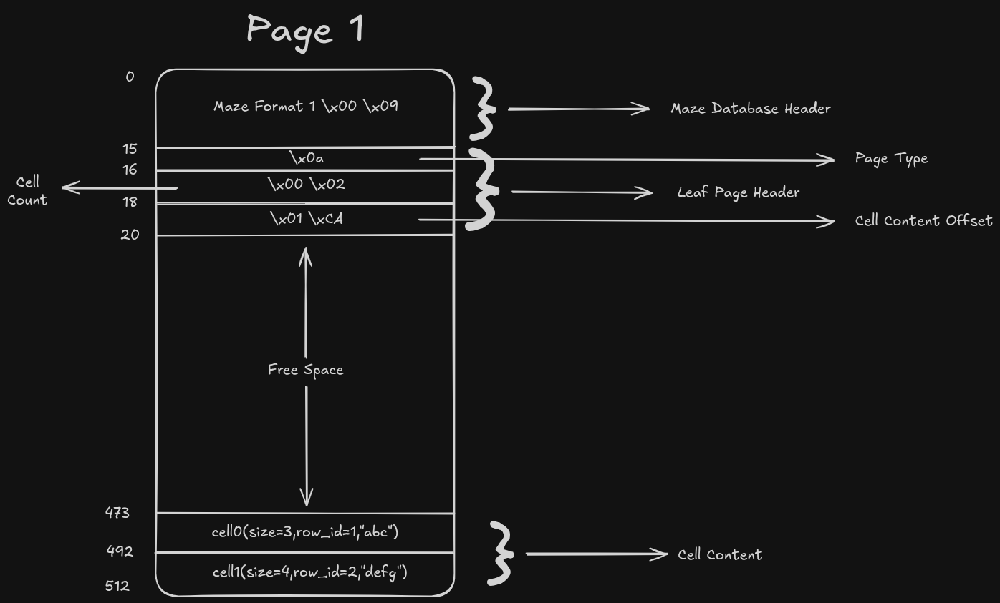

# The Database File
## Pages
- main database file consists of one or more pages
- each page is the same size in the same database file (no variable length pages)
- the page size is determined by a 2-byte integer located at a 16-byte offset from beginning of the file
- the size can be between 512 (2^9) to 65536 (2^16) bytes
- page numbers begin w 1, max being 2^32 - 2.
- min size of sqlite database = 512 bytes (a single 512 byte page)
- max size = (2^32 - 2)(2^16) ~ 281 TB, but host FS max file size limit will be hit first.
- a page can be used either as
    1. b-tree page
        1. a table b-tree interior page
        2. a table b-tree leaf page
        3. an index b-tree interior page
        4. an index b-tree leaf page
    2. freelist page
        1. a freelist trunk page
        2. a freelist leaf page
    3. A payload overflow page
    4. A pointer map page
    5. The lock-byte page

- all reads from and writes to the main database file begin at a page boundary 
    - all writes are an integer number of pages in size
    - reads are also usually an integer number of pages in size, with one exception 
        - when the database is first opened, the first 100 bytes of the database file (the database file header) are read as a sub-page size unit
## The Database Header
- first 100 bytes are the header
- stored in normal big-endian style (MSB to LSB left to right)

| Offset | Size | Description |
| :---:  | :---:| :---        |
| 0 | 14 | Header string "Maze format 1\0" |
| 14 | 1 | Page size $\in$ [9, 16] |
<!-- | 15 | 8 | Pointer to first Freelist block | -->

Database header size = 15B (as of now)

## b-tree Page Cells
- A cell's (interior or leaf page cell) `row_id` can be 0. The first cell's `row_id` must be 0.