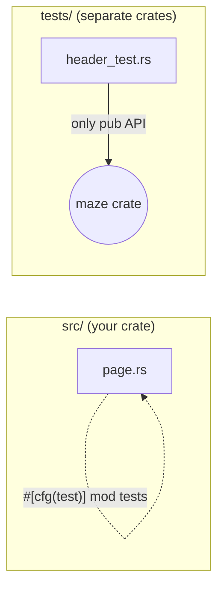

# Subproject 0 — Baseline Hygiene

Before touching B-trees or file formats, get the feedback loop right. Every
subproject after this one assumes `cargo build`, `cargo test`, and
`cargo clippy` are fast, reliable signals. This file has less "database
theory" and more "how Rust projects stay sane" — but it matters just as
much, because a flaky dev loop will quietly sabotage everything you build
on top of it.

## Why this matters for a from-scratch binary-format project

You're about to write code that parses raw bytes by hand. That category of
code is unusually easy to get subtly wrong (off-by-one offsets, endianness
mixups, forgetting a length field) and unusually hard to debug by staring at
it — the bug is "the 47th byte means something different than you think,"
not a logic error you can reason your way to. The defense against this is
*tests that pin down byte-level expectations*, run constantly, with zero
friction. Subproject 0 is entirely in service of that.

## Project layout

A typical Rust binary crate that's about to grow a lot of internal modules
looks like this:

```
maze/
├── Cargo.toml
├── Cargo.lock
├── FILE.md
├── PLAN.md
├── src/
│   ├── main.rs        # binary entry point
│   ├── utils.rs
│   └── file/
│       ├── mod.rs     # `pub mod header; pub mod page; mod types;`
│       ├── header.rs
│       ├── page.rs
│       └── types.rs
└── tests/             # integration tests — compiled as a SEPARATE crate
    └── header_test.rs
```

The distinction between **unit tests** and **integration tests** in Rust is
structural, not just "where you put them":

- Unit tests live inside `src/**/*.rs`, in a `#[cfg(test)] mod tests { ... }`
  block in the same file as the code they test. They can see private
  (non-`pub`) items because they're compiled as part of the same crate.
- Integration tests live in `tests/*.rs`. Each file there is compiled as its
  **own separate crate** that depends on yours like any external user would
  — it can only call `pub` items. This is exactly the right shape for the
  end-to-end tests described in later subprojects (e.g. "open a file, insert
  rows, scan them back") because it forces you to design a usable public API
  instead of testing internals.



## Rust concept: `#[cfg(test)]` and `#[test]`

```rust
// inside src/file/varint.rs (illustrative, not your real module yet)
pub fn double(x: u32) -> u32 {
    x * 2
}

#[cfg(test)]
mod tests {
    use super::*; // bring the parent module's items into scope

    #[test]
    fn doubles_correctly() {
        assert_eq!(double(21), 42);
    }

    #[test]
    #[should_panic]
    fn panics_on_overflow() {
        double(u32::MAX); // overflow in debug builds panics
    }
}
```

- `#[cfg(test)]` means "only compile this module when running `cargo test`"
  — it adds zero bytes to your release binary.
- `super::*` imports everything from the enclosing module, including private
  items — this is *the* reason unit tests go next to the code.
- `assert_eq!`/`assert!`/`assert_ne!` panic (with a helpful diff for
  `assert_eq!`) on failure, which `cargo test` reports as a failed test.

## Rust concept: lints — `clippy` and `rustfmt`

`rustfmt` is purely about formatting (whitespace, line breaks) and has no
opinions about logic. `clippy` is a linter that catches real mistakes and
idiom violations the compiler itself allows, e.g.:

- comparing floats with `==`
- needless `.clone()` calls
- `match` expressions that could be a simpler `if let`
- integer casts that silently truncate

Run them as part of your habitual loop:

```bash
cargo fmt
cargo clippy --all-targets -- -D warnings   # -D warnings = treat warnings as errors
cargo test
```

You can also pin lint behavior in code:

```rust
#![warn(clippy::all)]      // top of main.rs — opt the whole crate into clippy's default group
```

## Rust concept: `anyhow` (already a dependency)

You're already using `anyhow::Result<T>` (an alias for
`Result<T, anyhow::Error>`) and `anyhow::bail!`/`anyhow!`. The mental model:

- `anyhow::Error` can wrap *any* error type that implements `std::error::Error`
  (or even just a formatted string via `anyhow!("...")`), which is perfect
  for application code (a binary) where you mostly want to propagate errors
  upward and print them, not pattern-match on error *kind*.
- Contrast this with defining your own `enum MazeError { BadMagic, ShortRead, ... }`
  and implementing `std::error::Error` for it — more ceremony, but lets
  callers `match` on specific failure modes. Later subprojects (e.g. the SQL
  parser distinguishing "syntax error" from "unknown table") are a good
  candidate for revisiting this tradeoff; for now `anyhow` is the right
  default.

```rust
fn parse_magic(buf: &[u8]) -> anyhow::Result<()> {
    let got = buf.get(0..4).ok_or_else(|| anyhow::anyhow!("buffer too short"))?;
    if got != b"MAZE" {
        anyhow::bail!("bad magic bytes: {got:?}");
    }
    Ok(())
}
```

The `?` operator is the core ergonomic win: it early-returns `Err(e)` from
the current function if the expression is an `Err`, converting the error
type via `From`/`Into` along the way (which is how a `TryFrom` error or an
`std::io::Error` can flow into an `anyhow::Result` without manual wrapping).

## Checklist mapping

Reconciling `FILE.md` vs. `header.rs`'s offset constants isn't a "theory"
task — it's just careful reading. The useful habit to build here: whenever
your design doc and your code disagree, **the test you write to pin down
the real answer is more valuable than either document**, because it's the
only one of the three that's automatically checked every time you run
`cargo test`.
