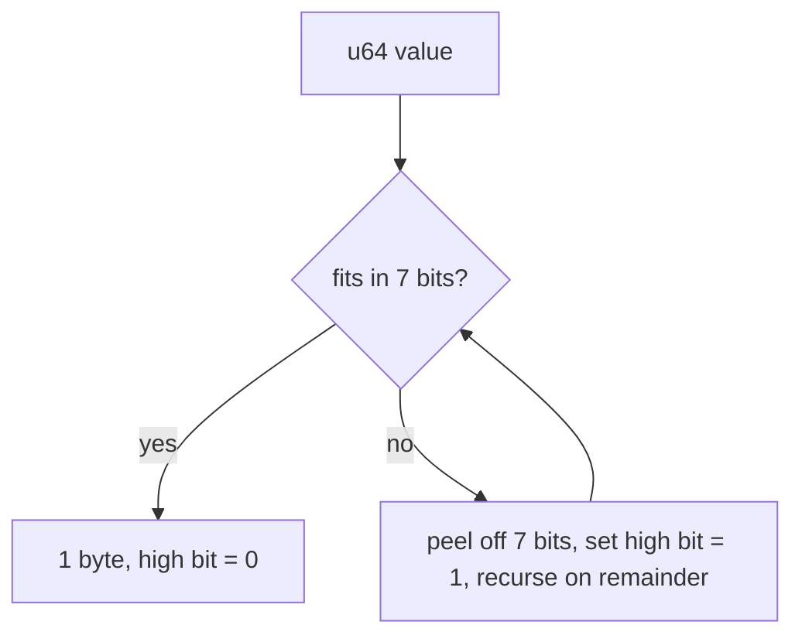

# Subproject 1 — Storage Format Foundation

This subproject is about one core idea: **a database file is just bytes you
define the meaning of.** Everything later — records, B-trees, indexes — is
built out of two primitives you'll solidify here: fixed-width integers at
known offsets, and variable-width integers ("varints") whose length you have
to compute as you decode.

## Why binary formats at all?

You could store a database as JSON or CSV. The reasons real databases don't:

1. **Random access.** You want to jump to "row 9000" without scanning the
   8999 rows before it. That requires fixed-size units (pages) you can seek
   to directly by multiplying an index by a size — `offset = page_number *
   page_size`. Text formats don't give you that; you'd have to scan for
   newlines.
2. **Compactness.** A `u32` is 4 bytes. The text `"4294967295"` is 10 bytes
   (and variable-width, which defeats random access anyway).
3. **Precision.** Floating point numbers round-trip exactly in binary;
   text → float → text can lose precision.

The cost is that binary formats are opaque to `cat` and easy to get subtly
wrong — which is exactly why Subproject 0's testing habits matter.

## Endianness

A multi-byte integer can be stored most-significant-byte-first (**big-endian**,
what SQLite and your header use) or least-significant-byte-first
(**little-endian**, what x86/ARM CPUs use natively). It's purely a
convention for how 4 bytes map to a 32-bit number — there's no "correct"
answer, you just have to be consistent between writer and reader.

```
Value: 0x12345678  (305419896 decimal)

Big-endian bytes:    [0x12, 0x34, 0x56, 0x78]   (MSB first — "reads left to right")
Little-endian bytes: [0x78, 0x56, 0x34, 0x12]   (LSB first — native x86/ARM)
```

Rust's integer types expose both directly:

```rust
let n: u32 = 0x12345678;
assert_eq!(n.to_be_bytes(), [0x12, 0x34, 0x56, 0x78]);
assert_eq!(n.to_le_bytes(), [0x78, 0x56, 0x34, 0x12]);

let back = u32::from_be_bytes([0x12, 0x34, 0x56, 0x78]);
assert_eq!(back, n);
```

Your `utils.rs` helpers (`read_word_u32_be`, etc.) are thin wrappers around
exactly this — slice out N bytes, hand them to `from_be_bytes`.

## Fixed-width vs. variable-width encoding

A `u64` always costs 8 bytes, whether the value is `0` or
`18446744073709551615`. For fields that are *usually small* — a payload
length, a row id — that's wasteful at scale (millions of rows × wasted
bytes). The fix is a **variable-length integer** ("varint"): small values
cost 1 byte, only large values cost more.

### How SQLite-style varints work

Split the value into 7-bit groups. For each byte except the last, set the
high bit (`0x80`) to say "more bytes follow"; the final byte's high bit is
clear. The *last* possible byte (the 9th) is a special case that uses all 8
bits, since at that point you're encoding the top bits of a `u64` and 7-bit
grouping would need a 10th byte for the last bit.

```
Encoding the value 300 (0b1_0010_1100):

Split into 7-bit groups from the LOW end:
  group0 (low 7 bits)  = 0101100  (0x2C)
  group1 (next 7 bits) = 0000010  (0x02)

Emit HIGH-order group first, with continuation bits:
  byte0 = 1_0000010   (0x82)   <- continuation bit set, this is group1
  byte1 = 0_0101100   (0x2C)   <- continuation bit clear, this is group0, last byte

Encoded bytes: [0x82, 0x2C]   (2 bytes, instead of 8 for a fixed u64)
```

```
Small value: 100 (fits in 7 bits) → single byte, high bit clear:
  byte0 = 0_1100100  (0x64)    <- 1 byte total
```

This is the same family of idea as **LEB128** (used in DWARF debug info,
WebAssembly, protobuf's varints), just with the groups emitted
most-significant-group-first instead of least-significant-group-first, and
a 9-byte special case capping the length. The general technique — "peel off
7 bits at a time, flag whether more follow" — is what you're implementing;
the exact bit order and the 9-byte cap are the SQLite-specific details
`FILE.md`/your own design should pin down.



### Why this matters for page layout

A cell's payload length and row id are exactly the kind of "usually small"
numbers varints exist for — most rows are small, but the format shouldn't
cap row ids at 2 bytes just because most of them are small. Using varints
here is also what makes a cell **self-describing**: you read the varint
length byte-by-byte, and you *know when to stop* because the continuation
bit tells you, without needing a separate "how long is this varint" field.

## Rust concepts you'll lean on

### `&[u8]` slices, not `Vec<u8>`, for parsing

Parsing functions should take `&[u8]` (a borrowed view into bytes you don't
own) rather than `Vec<u8>` (owned, heap-allocated) wherever possible. This
avoids copying — a page is already sitting in a buffer somewhere (eventually
the pager's cache); your parser just needs to *look at* it.

```rust
fn read_u16_be(buf: &[u8], at: usize) -> Option<u16> {
    let bytes: [u8; 2] = buf.get(at..at + 2)?.try_into().ok()?;
    Some(u16::from_be_bytes(bytes))
}
```

Note the pattern already in your `utils.rs`: `buf.get(at..at+N)` returns
`Option<&[u8]>` — `None` if the range is out of bounds — rather than
`buf[at..at+N]` which **panics** on an out-of-bounds range. For code parsing
untrusted/arbitrary bytes, prefer `get` + `?`/`ok_or_else` over direct
indexing every time; a malformed file should produce an `Err`, never crash
the process.

### `TryFrom`/`TryInto` for validated conversions

Your `PageType::try_from(u8)` is the idiomatic Rust pattern for "this
conversion can fail." The trait:

```rust
pub trait TryFrom<T>: Sized {
    type Error;
    fn try_from(value: T) -> Result<Self, Self::Error>;
}
```

Implementing it (as you already do for `PageType`) means callers get the
`?` operator and `.try_into()` for free:

```rust
let pt: PageType = buf[0].try_into()?; // works because you impl'd TryFrom<u8> for PageType
```

### Bit manipulation operators

Varint encode/decode is the first place you'll need these in anger:

```rust
let byte: u8 = 0b1000_0101;
let has_continuation = byte & 0x80 != 0;      // mask: isolate the top bit
let payload_bits = byte & 0x7F;               // mask: clear the top bit, keep low 7
let shifted_in = (accumulator << 7) | payload_bits as u64; // shift existing bits left, OR in new ones
```

- `&` (AND) with a mask isolates specific bits.
- `|` (OR) combines bits from two values.
- `<<`/`>>` shift bits left/right, used to make room for the next 7-bit
  group or to extract a group from a larger accumulated value.

### Round-trip testing (property-style, by hand)

Without a crate like `proptest`, you can still get most of the value by
writing a small loop over interesting values:

```rust
#[test]
fn varint_round_trips() {
    let interesting = [0u64, 1, 127, 128, 255, 16384, u32::MAX as u64, u64::MAX];
    for &v in &interesting {
        let encoded = encode(v);
        let (decoded, len) = decode(&encoded).unwrap();
        assert_eq!(decoded, v);
        assert_eq!(len, encoded.len());
    }
}
```

The boundary values (`127` vs `128`, i.e. just below/above a 7-bit group
boundary) are exactly where off-by-one bugs in this kind of code live —
always include them explicitly rather than relying on random values alone.

## Golden-file tests

A "golden file" test means: you hand-construct the exact bytes you expect a
correct encoder to produce (or that you expect your decoder to handle),
inline in the test, as the ground truth — rather than only testing
`encode(decode(x)) == x`, which could pass even if both functions share the
same bug.

```rust
#[test]
fn parses_hand_built_header() {
    let mut bytes = vec![0u8; 23];
    bytes[0..14].copy_from_slice(b"Maze Format 1\0");
    bytes[16] = 12; // page_size_exp = 12  =>  page size 4096
    let header = HeaderInfo::from(&bytes).unwrap();
    assert_eq!(header.page_size_exp.get(), 12);
}
```

This is the technique the plan's checklist calls "golden file" tests — it's
your main defense against the entire reader and writer silently agreeing on
a wrong interpretation of the format.
