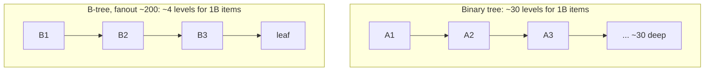
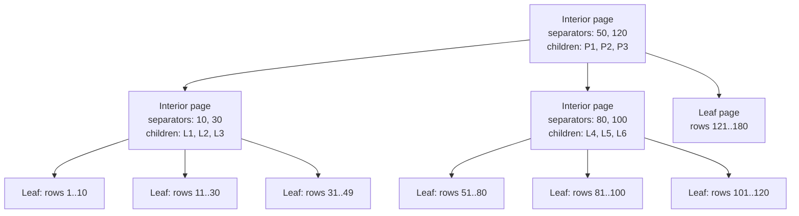
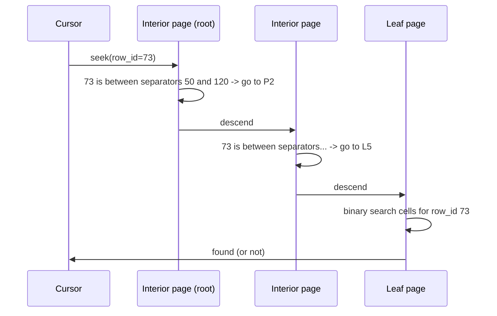

# Subproject 3 — B-Tree Read Path

This is the first subproject that's really about *database theory* rather
than byte-wrangling: B-trees, the data structure that makes "find row
8,432,991 among a billion rows" fast on disk.

## Why not a binary search tree?

A classic in-memory binary search tree (BST) has at most 2 children per
node, so a balanced BST over N items has height ~`log2(N)`. For a billion
rows, that's ~30 levels. On disk, **each level of tree traversal you
descend is potentially one disk seek** — and a disk seek (even on an SSD,
relative to RAM) is enormously expensive compared to a RAM access. 30 seeks
per lookup is bad.

A **B-tree** fixes this by making each node hold *many* children (its
**fanout**) — often hundreds, bounded by how many separator keys fit in one
disk page. With a fanout of, say, 200, a billion rows needs only
`log200(1,000,000,000) ≈ 4` levels. Same idea, far fewer seeks, because each
single page read does the work of ~200 BST comparisons' worth of narrowing.



## Shape of a table B-tree

Every node is one page. There are two kinds of pages:

- **Leaf pages**: hold the actual cells (row id + payload bytes), in
  ascending row-id order.
- **Interior pages**: hold no row data directly — only separator keys and
  pointers to child pages, used purely to route a search toward the right
  leaf.



Key invariants (the ones your Subproject 5/6 "invariant checker" will
assert programmatically):

- **All leaves are at the same depth.** No leaf is "closer to the root"
  than another — this is what keeps lookups' worst case bounded.
  (This is the defining property that distinguishes a B-tree from, say, an
  unbalanced BST — balance isn't a nice-to-have, it's the whole point.)
- **Keys within a leaf are sorted**, and leaves are sorted relative to each
  other (every key in `L1` < every key in `L2`).
  - **Each separator in an interior page bounds its subtree**: for a
  separator `k` between children `Cᵢ` and `Cᵢ₊₁`, every key in `Cᵢ`'s subtree
  is `≤ k` (or `<`, depending on your convention — pick one and be
  consistent) and every key in `Cᵢ₊₁`'s subtree is `> k`.

Your existing `TableLeafCell { size, row_id, payload }` is a leaf cell. The
new `TableInteriorCell` you're about to add is conceptually
`{ child_page_number, max_row_id_in_subtree }` — note it carries *no
payload* at all, only routing information.

## The search algorithm

Searching for `row_id = X` starting at the root:

1. If this page is a **leaf**: linear/binary search its cells for `X`;
   found or not, you're done — return the result.
2. If this page is **interior**: scan its separator keys to find which
   child's range contains `X`, then **recurse (or iterate) into that
   child page** and repeat from step 1.



A full **ordered scan** (every row, in order) is the same idea but starting
from the *leftmost* leaf and then visiting leaves left-to-right — which is
exactly why "all leaves sorted relative to each other, same depth" matters:
it guarantees an in-order traversal of leaves produces globally sorted
output without needing to look at interior pages again once you've found
the first leaf.

## B-tree vs. B+tree — a preview

You'll hit real B+tree territory in Subproject 8 (secondary indexes), but
the terminology is worth fixing now: a **B-tree** can store data in interior
nodes too; a **B+tree** restricts *all* data to leaves, with interior nodes
purely for routing — which is exactly what's described above for your table
tree. SQLite's table trees are B+trees in this sense (interior pages carry
no row payloads), even though the SQLite docs call them "b-trees"
throughout. You're building the same thing.

## Rust concepts you'll lean on

### Binary search on a sorted slice

Once a page's cells/separators are sorted, `binary_search_by` (or
`binary_search_by_key`) is the standard-library tool instead of hand-rolling
the loop:

```rust
let separators: Vec<u64> = vec![10, 30, 50, 80];
let target = 42;

// find the index of the first separator >= target
let idx = separators.partition_point(|&s| s < target);
assert_eq!(idx, 2); // separators[2] == 50, the first one >= 42
```

`partition_point` (stable since Rust 1.52) is often a better fit than
`binary_search_by` for "find the boundary between two regions" style
searches like this one, because it doesn't force you to handle the
`Ok`/`Err` cases of an exact-match search when you actually want "where
would this go."

### Recursion vs. an explicit loop for tree descent

A recursive descent is the most direct translation of "search this page;
if interior, search the child page":

```rust
fn search(pager: &Pager, page_id: u32, target: u64) -> anyhow::Result<Option<Row>> {
    match pager.read_page(page_id)?.kind() {
        PageKind::Leaf(leaf) => Ok(leaf.find(target)),
        PageKind::Interior(interior) => {
            let child = interior.child_for(target);
            search(pager, child, target) // recursive call
        }
    }
}
```

This is perfectly fine — tree depth is tiny (a handful of levels even for
huge datasets, per the fanout argument above), so there's no real stack-depth
risk, unlike, say, recursing over an unbounded linked list. An explicit loop
with a `current_page_id` variable you reassign is an equally valid
non-recursive alternative if you'd rather avoid the recursive call for
borrow-checker reasons (see next point) — both are idiomatic; pick whichever
is easier to get the borrow checker to accept once `pager: &mut Pager` is
involved.

### Why page ids, not `Box<Node>` pointers

A natural first instinct from other languages: represent the tree with
actual pointers/references between node structs (`Box<Node>`,
`Rc<RefCell<Node>>`, etc.). Resist this. The tree lives **on disk**; pages
reference each other by **page number** (a plain `u32`), exactly the way
your `TableInteriorCell` already does. A few reasons this is the right
design, not just a limitation:

- Pages need to be independently loadable — you can't deserialize "the
  whole tree" into pointer-linked structs on every open; you load one page
  at a time via the pager (Subproject 4), on demand.
  - A `u32` page id trivially serializes (it's already a number on disk);
  an in-memory pointer does not.
- It avoids an entire category of Rust borrow-checker pain: multiple parts
  of your code holding `&mut` references into different nodes of the "same"
  structure simultaneously. Indexing through a `Pager` by `PageId` (an
  integer) sidesteps this — you ask the pager for a page when you need it,
  you don't hold a long-lived reference into tree-internal structure.

This is the same lesson as "arena allocation" / "ECS-style" patterns you may
have seen described for Rust game engines or graph structures: when a
language's ownership model makes pointer-heavy graphs painful, index into a
flat collection by a plain integer ID instead. Your `Pager` (next
subproject) *is* that flat collection, and `PageId` is the index.

### Implementing `Iterator` for the ordered-scan cursor

Rust's `Iterator` trait is one method:

```rust
trait Iterator {
    type Item;
    fn next(&mut self) -> Option<Self::Item>;
}
```

Implementing it for your `Cursor` means every `for row in cursor { ... }`,
`.collect::<Vec<_>>()`, `.filter(...)`, `.map(...)` etc. just work, for
free, on top of one `next()` method you write:

```rust
struct Cursor<'p> {
    pager: &'p Pager,
    current_leaf: Option<u32>,
    index_in_leaf: usize,
}

impl<'p> Iterator for Cursor<'p> {
    type Item = anyhow::Result<Row>;

    fn next(&mut self) -> Option<Self::Item> {
        // pseudo-shape, not your real logic:
        // if index_in_leaf has more cells, return the next one and advance;
        // else advance current_leaf to the next leaf page (or return None if exhausted)
        todo!()
    }
}
```

The `'p` lifetime parameter says "this `Cursor` can't outlive the `Pager`
reference it borrowed" — the compiler will stop you from, say, storing a
`Cursor` somewhere and then dropping or mutating the `Pager` it still
depends on, while the cursor is alive. This is exactly the kind of bug class
(dangling/stale pointer into data structures) that's common and silent in
C, and a compile error in Rust.
