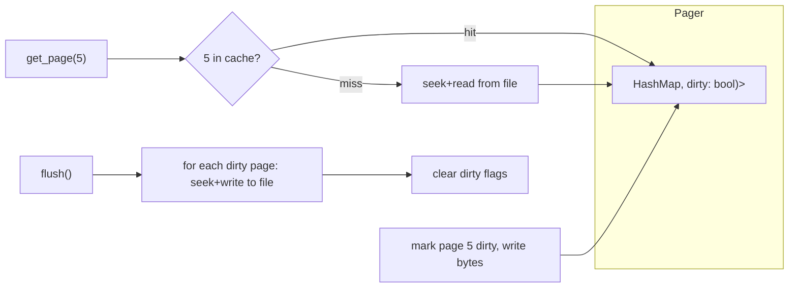

# Subproject 4 — Pager / Buffer Pool

Up to now, parsing has operated on `&[u8]` slices you constructed by hand in
tests. This subproject introduces the thing that actually talks to a real
file on disk, and — just as importantly — a **cache** in front of it so you
aren't doing a disk read/write for every single page access.

## Why a pager layer exists at all

Everything above this layer (records, B-trees) should only ever think in
terms of "give me page N" / "give me a new page" / "I changed page N" — not
file handles, not byte offsets, not when exactly a write hits disk. That
separation is valuable for the same reason any abstraction layer is: it lets
you change *how* pages are stored (e.g. add caching, add a freelist, add
compression) without touching the B-tree code that just wants `Page`
objects by number.

```mermaid
flowchart TB
    Exec["Executor / B-tree code"] -->|"get_page(id) / new_page() / mark_dirty(id)"| Pager
    Pager -->|cache hit: return from memory| Cache[("In-memory page cache")]
    Pager -->|cache miss: read N bytes at offset| Disk[("File on disk")]
    Pager -->|flush(): write dirty pages back| Disk
```

## Pages as fixed-size disk blocks

The entire reason page numbers can be translated to file offsets with pure
arithmetic (`offset = page_number * page_size`, with a small adjustment for
page 1 since it shares its first bytes with the file header) is that every
page is the **same fixed size** — this is the header rule you already
encoded in `FILE.md`. That's what makes the pager's core read operation a
single `seek` + `read_exact`, no indirection or lookup table needed.

```
File layout (page_size = 4096, for example):

byte 0                                  byte 4095  byte 4096                 byte 8191
┌────────────────────────────────────────────┐┌────────────────────────────────────────┐
│ [23-byte header][ page 1's page-level data ]││          page 2                          │
└────────────────────────────────────────────┘└────────────────────────────────────────┘
        page_number = 1                                 page_number = 2

offset_of(page_number) = (page_number - 1) * page_size
```

## The buffer pool / page cache idea

Reading from disk (even an SSD) is orders of magnitude slower than reading
from RAM. A real DBMS's **buffer pool** keeps recently/frequently used pages
in memory and only touches disk on a genuine **cache miss**. Writes are
typically **write-back**, not write-through: a modified page is marked
**dirty** and kept in memory; it's only actually written to disk later (on
an explicit flush/checkpoint, or when evicted to make room for another
page). This is a huge performance win, but it's exactly *why* durability
(Subproject 12) is a separate hard problem — "the data looks committed in
memory" and "the data survived a crash" are different claims once write-back
caching exists.



Your plan's Subproject 4 deliberately uses the simplest possible cache (a
`HashMap` with no eviction) — real buffer pools need an eviction policy
(LRU, clock, etc.) once memory is smaller than the dataset, which is a whole
topic on its own (worth reading about, not worth implementing yet: every
eviction policy is answering "which page's absence will hurt least," under
a memory budget you don't need to enforce for a toy project's scale).

## Rust concepts you'll lean on

### `std::fs::File` + `Read`/`Write`/`Seek`

```rust
use std::fs::{File, OpenOptions};
use std::io::{Read, Seek, SeekFrom, Write};

fn read_page_from_disk(file: &mut File, page_size: u64, page_number: u32) -> std::io::Result<Vec<u8>> {
    let offset = (page_number as u64 - 1) * page_size;
    file.seek(SeekFrom::Start(offset))?;
    let mut buf = vec![0u8; page_size as usize];
    file.read_exact(&mut buf)?;
    Ok(buf)
}

fn write_page_to_disk(file: &mut File, page_size: u64, page_number: u32, data: &[u8]) -> std::io::Result<()> {
    let offset = (page_number as u64 - 1) * page_size;
    file.seek(SeekFrom::Start(offset))?;
    file.write_all(data)?;
    Ok(())
}

fn open_rw(path: &str) -> std::io::Result<File> {
    OpenOptions::new().read(true).write(true).open(path)
}
```

- `read_exact` (vs. plain `read`) fails unless it fills the *entire* buffer
  — exactly what you want for fixed-size pages; a short read means something
  is wrong (truncated/corrupt file) and should be an error, not silently
  return fewer bytes.
- `SeekFrom::Start(offset)` is an absolute seek; `SeekFrom::Current`/`End`
  are relative — you'll only need `Start` here since every page's offset is
  computable directly.

### Mixing `std::io::Error` and `anyhow::Result`

`File`/`Read`/`Write`/`Seek` methods return `std::io::Result<T>` (i.e.
`Result<T, std::io::Error>`). Because `anyhow::Error` can be built `From`
any `std::error::Error` (and `std::io::Error` implements that trait), the
`?` operator converts automatically when the surrounding function returns
`anyhow::Result<T>`:

```rust
fn read_page(&mut self, id: u32) -> anyhow::Result<&[u8]> {
    self.file.seek(SeekFrom::Start(self.offset_of(id)))?; // io::Error -> anyhow::Error, transparently
    // ...
    Ok(&[])
}
```

### `HashMap` as the cache, and the entry API

```rust
use std::collections::HashMap;

struct Pager {
    file: std::fs::File,
    page_size: u32,
    cache: HashMap<u32, Vec<u8>>,
    dirty: std::collections::HashSet<u32>,
}

impl Pager {
    fn get_page(&mut self, id: u32) -> anyhow::Result<&Vec<u8>> {
        if !self.cache.contains_key(&id) {
            let bytes = read_page_from_disk(&mut self.file, self.page_size as u64, id)?;
            self.cache.insert(id, bytes);
        }
        Ok(self.cache.get(&id).unwrap()) // safe: we just ensured it's present
    }
}
```

A cleaner, more idiomatic version of the same "insert if missing, then
return it" logic uses `HashMap::entry`, which avoids the double lookup
(`contains_key` + `get`) and a separate "insert vs already there" branch:

```rust
fn get_page(&mut self, id: u32) -> anyhow::Result<&Vec<u8>> {
    use std::collections::hash_map::Entry;
    match self.cache.entry(id) {
        Entry::Occupied(e) => Ok(e.into_mut()),
        Entry::Vacant(e) => {
            let bytes = read_page_from_disk(&mut self.file, self.page_size as u64, id)?;
            Ok(e.insert(bytes))
        }
    }
}
```

### The classic "cache returning `&mut`" borrow-checker friction

If you want `get_page_mut(&mut self, id) -> &mut Vec<u8>` so callers can
modify a page in place, you'll notice the borrow checker ties the returned
`&mut Vec<u8>` to the *entire* `&mut self` borrow of the `Pager` for as long
as that reference lives — meaning you can't call another `&mut self` method
on the pager (like allocating a new page) while still holding onto a
previous page's `&mut` reference. This is Rust correctly preventing a real
bug class (two live mutable aliases into the same cache that could
invalidate each other, e.g. if `allocate_page` had to resize/rehash the
`HashMap`) — but it does mean you may need to restructure call sites to
"get page, extract what you need or finish mutating it, drop the reference,
*then* get the next page" rather than holding several page references open
simultaneously across a complex operation (this will matter concretely in
Subproject 5's split logic, which conceptually touches a leaf and its new
sibling and its parent "at once"). The usual fix is to fetch one page,
finish with it (copy out what you need into owned local variables), then
move on to the next — sequential borrows instead of overlapping ones.

### Why not just `Rc<RefCell<Page>>` to dodge this?

It's tempting to sidestep borrow-checker friction with shared,
reference-counted, runtime-checked mutable cells (`Rc<RefCell<T>>`), and
occasionally that's the pragmatic choice. But for a *learning* project, the
borrow checker's complaints here are pointing at a real design question
("can two parts of my code validly hold onto two different pages' mutable
state at once, and in what order do operations need to happen") that's
worth solving explicitly — `Rc<RefCell<T>>` would make the code compile but
move the "is this actually safe" question to a runtime panic
(`already borrowed`) instead of a compile-time structure. Prefer restructuring
first; reach for `RefCell` only if restructuring genuinely can't express
what you need.

### Temp files in tests without a crate

```rust
fn temp_db_path(test_name: &str) -> std::path::PathBuf {
    let mut path = std::env::temp_dir();
    let unique = std::time::SystemTime::now()
        .duration_since(std::time::UNIX_EPOCH)
        .unwrap()
        .as_nanos();
    path.push(format!("maze_test_{test_name}_{unique}.db"));
    path
}
```

Good enough for test isolation without pulling in `tempfile`; clean up with
`std::fs::remove_file` at the end of the test (or just leave it — OS temp
dirs get cleaned eventually, though explicit cleanup is better hygiene).
