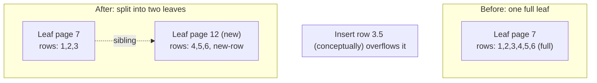
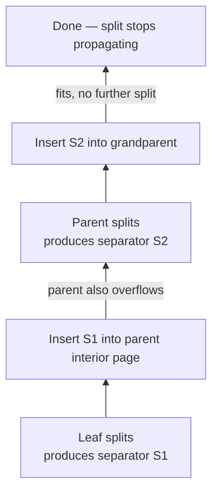
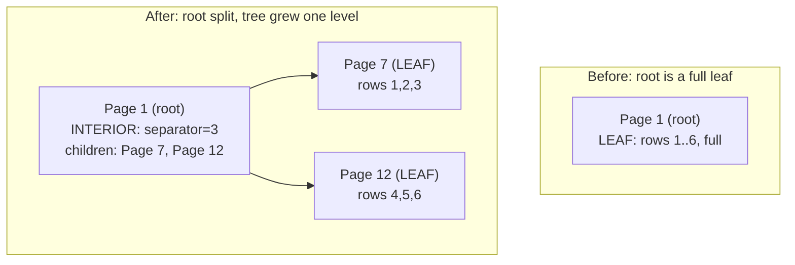

# Subproject 5 — B-Tree Write Path: Insert & Split

This is the subproject most people mean when they say "I want to understand
B-trees." Reading a B-tree (Subproject 3) is "follow the signs down."
Writing one is "keep the signs correct while the building is still being
built" — insertion has to preserve every invariant from Subproject 3 (sorted
order, all leaves at equal depth) *while growing the structure*.

## The core problem: pages have a fixed capacity

A page is a fixed number of bytes. At some point, inserting one more cell
into a full leaf simply doesn't fit. Unlike an in-memory `Vec` that can
reallocate to grow, a page can't grow — the fix is **structural**: the
overfull node is **split** into two nodes, and the tree above it has to
learn about the new node.

## Leaf split, step by step

1. You try to insert a new cell into a leaf; it would exceed the page's
   capacity.
2. Allocate a **new page** for half the cells.
3. Move the upper half of the (now N+1, counting the new one) cells to the
   new page, leaving the lower half in the original page.
4. The **smallest key in the new (right) page** becomes the **separator**
   that needs to be inserted into the parent, pointing at the new page.



## Split propagation: the parent might overflow too

Inserting the new separator `(key, new_child_page)` into the parent
interior page is just... another insert into a page, which can *itself*
overflow and need to split, pushing a separator up into *its* parent, and so
on. This is why insert is naturally described recursively (or as an
explicit stack-based loop): "insert into this page; if that caused a split,
insert the resulting separator into the parent; repeat."



Split propagation **terminates** because each level either absorbs the new
separator without overflowing (stop) or splits and produces exactly one new
separator for the level above (continue) — it can never produce *more* work
per level than one split, so it can't propagate forever; it can only climb
as high as the tree is deep.

## Root split: the one special case

If the **root** page overflows and splits, there's no parent to push a
separator into — the tree needs to **grow a new level**. The trick: the
root page's *page number* never changes (this matters hugely for
Subproject 9's catalog, which stores "table X's root is page N" — if the
root's page number could change on every split, every table/index record in
the catalog would need updating on every root split). Instead:

1. Allocate two *new* pages, and move the (about-to-split) root's entire
   current content into one of them (conceptually: the "old root" becomes a
   regular child now).
2. Actually, the simplest correct implementation: copy the current root
   page's content into a brand new page, split *that* into two new pages
   (the original split target plus the new sibling) exactly like a normal
   split, then **overwrite the root page itself** with a fresh interior
   page containing just one separator and two children pointing at the two
   new pages.



This is the one case your checklist calls out explicitly as needing careful
handling, because it's the only split that changes the tree's *height*
rather than just its *width* at some level.

## Rust concepts you'll lean on

### Modeling "normal result, or overflow with extra data to propagate" as an enum

The recursive insert function needs to communicate two different outcomes
to its caller: "done, nothing else to do" vs. "I split; here's the new
separator and child page number you need to insert into *your* level." An
enum return type makes this explicit and makes it impossible for a caller to
forget to handle the split case (the compiler's exhaustiveness check on
`match` enforces it):

```rust
enum InsertOutcome {
    Fit,
    Split { separator_key: u64, new_right_page: u32 },
}

fn insert_into_page(pager: &mut Pager, page_id: u32, key: u64, payload: &[u8])
    -> anyhow::Result<InsertOutcome>
{
    // ... insert into this page's cells ...
    // if it didn't fit:
    //     split, write both halves back via the pager,
    //     return InsertOutcome::Split { separator_key, new_right_page }
    // else:
    //     return InsertOutcome::Fit
    todo!()
}
```

The caller one level up pattern-matches and either stops or recurses with
the new separator as its own "value to insert":

```rust
match insert_into_page(pager, child_page_id, key, payload)? {
    InsertOutcome::Fit => { /* nothing more to do at this level */ }
    InsertOutcome::Split { separator_key, new_right_page } => {
        // insert (separator_key, new_right_page) into *this* interior page,
        // which recursively might itself produce another InsertOutcome::Split
    }
}
```

This pattern — "a function's result might carry extra work for the caller to
finish" — shows up constantly in systems code beyond B-trees (e.g. "did this
network write fully complete, or is there a remainder to retry"). It's worth
recognizing as a reusable shape, not a one-off trick.

### Splitting a `Vec` in half: `split_off`

```rust
let mut cells: Vec<Cell> = vec![/* ... */];
let midpoint = cells.len() / 2;
let right_half = cells.split_off(midpoint); // cells now holds [0..midpoint), right_half holds [midpoint..)
```

`split_off` mutates the original `Vec` in place (truncating it to the first
part) and *returns* a new `Vec` owning the second part — no manual copying,
no index juggling, and it transfers ownership of the moved elements cleanly
rather than requiring you to `.clone()` them.

### Moving data between two pages without fighting the borrow checker

A split fundamentally needs to write to *two* pages (the original, now
truncated, and the newly allocated sibling). Given the pager friction
described in Subproject 4's theory, the clean shape is usually:

1. Read the full page's cells out into an **owned, local** `Vec<Cell>`
   (detaching from any borrow of the pager).
2. Do all the splitting logic purely on that local `Vec` (no pager
   involved — just plain Rust data manipulation).
3. Serialize the left half back into the original page via the pager.
4. Allocate the new page, serialize the right half into it via the pager.
5. Only *then* go update the parent (another, separate pager interaction).

Each pager interaction is short-lived and sequential, never overlapping with
another — sidestepping the "two live mutable borrows into the cache"
problem entirely, at the cost of one extra copy of the page's cells into a
`Vec`. For page sizes in the kilobytes and tree operations that are already
dominated by disk I/O cost, that copy is irrelevant overhead — don't
over-optimize this.

### Choosing recursion depth is safe here, too

Just like the read-path search, insert's recursive call depth is bounded by
the tree's height (a handful of levels), so plain recursive functions
(rather than an explicit manual stack) are a perfectly reasonable, idiomatic
choice here — no special precautions needed beyond what Subproject 3
already covered.
