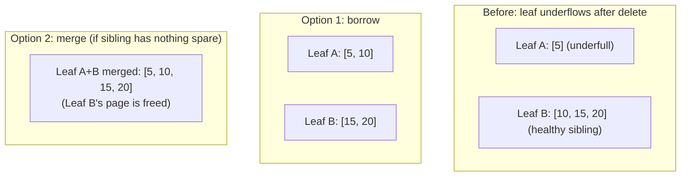

# Subproject 6 — Delete & Rebalancing

Deletion is the B-tree operation most tutorials wave away, because "full"
rebalancing (borrow a key from a sibling, or merge with a sibling, keeping
every node within `[minFill, maxFill]` bounds at all times) has a lot of
fiddly cases. Your plan deliberately asks you to pick an explicit,
*simplified* policy instead of implementing the full textbook algorithm —
the theory below covers both, so you understand what you're simplifying
away and why that's a reasonable choice for a learning project.

## The symmetric problem to Subproject 5

Insertion overflows a node (too many cells); deletion **underflows** one
(too few cells to be considered "healthy"). The textbook fix is symmetric to
splitting:

- **Borrow from a sibling**: if an adjacent sibling has spare cells, move
  one over (and adjust the separator key in the parent) — cheaper than a
  merge, no page is freed.
- **Merge with a sibling**: if no sibling has spare cells, combine the
  underflowed node with one sibling into a single node, and remove the
  now-redundant separator from the parent — which might itself underflow,
  propagating up, mirroring split propagation.



## The simplification this plan recommends

Full borrow/merge-on-every-underflow is real, correct, textbook B-tree
behavior — and also a lot of surface area for a toy project whose purpose
is learning, not shipping a production engine. The plan asks you to pick and
**document** one explicit, simpler policy, for example:

> Tolerate underfull leaves (don't rebalance just because a leaf dipped
> below some minimum fill threshold). Only merge two leaves when one becomes
> **completely empty**, reclaiming its page via the freelist.

This keeps correctness (no leaf ever has fewer than zero cells, obviously;
no leaf is ever left in an inconsistent state) while skipping the
borrow-from-sibling case and the "rebalance at every threshold crossing"
case entirely. The tradeoff you're explicitly accepting: your tree can end
up less densely packed than a textbook B-tree would (more pages than
strictly necessary for a given row count) — a reasonable price for a lot
less implementation complexity, and worth writing down in a comment/README
precisely *because* it's a deliberate choice a reader shouldn't mistake for
an oversight.

This mirrors a real pattern in production systems, too: LSM-tree-based
stores (LevelDB, RocksDB) tolerate "stale"/fragmented state between
compaction passes rather than rebalancing on every write, because eager
rebalancing isn't worth its cost. Simplifying "when do we tidy up" is a
legitimate engineering decision, not just a shortcut for toy projects.

## Why invariant checkers matter more here than anywhere else

Delete logic is where B-tree implementations most often silently break an
invariant without crashing — e.g. a merge that frees a page but forgets to
remove the dangling separator pointing at it, or a parent that ends up with
one more child than separator. These bugs frequently don't manifest as a
panic; they manifest as "lookups for some row silently return nothing" or
"the tree works until you insert one more thing," discovered far from the
code that caused them. A reusable invariant-checking function —
walk the whole tree and assert: all leaves at equal depth, every page's
keys sorted, every separator consistent with its subtree's actual
min/max — run after *every* mutating operation in tests, is your main
defense. Writing it now (Subproject 5/6) and reusing it through every later
subproject that touches the tree (freelist, overflow pages, indexes) is far
more valuable than writing more delete-specific unit tests alone.

## Rust concepts you'll lean on

### Hand-rolled deterministic PRNG for fuzz-style tests

Your plan's "hand-roll everything" ethos extends nicely to randomized
testing: rather than pulling in the `rand` crate, a tiny deterministic
pseudo-random generator is easy to write and gives you **reproducible**
"random" test sequences (same seed → same sequence of inserts/deletes every
run, which matters enormously when a test fails and you need to reproduce
it). A classic simple choice is **xorshift**:

```rust
struct Xorshift64(u64);

impl Xorshift64 {
    fn new(seed: u64) -> Self {
        Xorshift64(if seed == 0 { 0xDEADBEEF } else { seed }) // 0 is a fixed point, avoid it
    }

    fn next_u64(&mut self) -> u64 {
        let mut x = self.0;
        x ^= x << 13;
        x ^= x >> 7;
        x ^= x << 17;
        self.0 = x;
        x
    }

    fn next_in_range(&mut self, n: u64) -> u64 {
        self.next_u64() % n
    }
}

#[test]
fn fuzz_insert_delete() {
    let mut rng = Xorshift64::new(42); // fixed seed: reproducible
    for _ in 0..1000 {
        let row_id = rng.next_in_range(10_000);
        // ... randomly insert or delete row_id, check invariants ...
    }
}
```

This isn't cryptographically random (don't use it for anything
security-sensitive — irrelevant here, but worth knowing *why* this pattern
is "good enough for tests, wrong for crypto"), but it's exactly what
deterministic test fuzzing needs.

### Reference-model testing with `std::collections::BTreeMap`

A powerful, low-effort correctness check: maintain a plain
`std::collections::BTreeMap<RowId, Payload>` in your test alongside your
own B-tree, apply every insert/delete to *both*, and after each operation
(or periodically) assert your tree's full scan matches the reference map's
iteration order exactly. This turns "did my delete implementation work?"
into a mechanical comparison instead of manual reasoning about specific
cases — and it's a nice bit of irony/insight worth noticing: the standard
library's `BTreeMap` is a real (if more sophisticated) B-tree implementation
you get to peek at the *behavior* of without looking at its internals, as a
free correctness oracle for the one you're building by hand.

```rust
use std::collections::BTreeMap;

#[test]
fn matches_reference_model() {
    let mut reference: BTreeMap<u64, Vec<u8>> = BTreeMap::new();
    let mut my_tree = /* your tree, freshly created */;
    let mut rng = Xorshift64::new(7);

    for _ in 0..500 {
        let key = rng.next_in_range(200);
        if rng.next_u64() % 2 == 0 {
            let payload = key.to_be_bytes().to_vec();
            reference.insert(key, payload.clone());
            my_tree.insert(key, &payload).unwrap();
        } else {
            reference.remove(&key);
            my_tree.delete(key).unwrap();
        }
    }

    let expected: Vec<(u64, Vec<u8>)> = reference.into_iter().collect();
    let actual: Vec<(u64, Vec<u8>)> = my_tree.scan().unwrap();
    assert_eq!(actual, expected);
}
```

### `debug_assert!` for invariant checks you don't want in release builds

```rust
fn check_invariants(&self) {
    debug_assert!(self.leaves_all_same_depth(), "leaves diverged in depth");
    debug_assert!(self.all_pages_sorted(), "a page's keys aren't sorted");
}
```

`debug_assert!` compiles to nothing in `--release` builds (unlike `assert!`,
which always runs) — appropriate for invariant checks that are expensive to
run on every operation and are purely a development-time safety net, not
something a deployed binary should pay for. For a project at this stage,
you'll likely just always run in debug/test mode anyway, but it's worth
knowing the distinction exists and why it's named differently from `assert!`.
