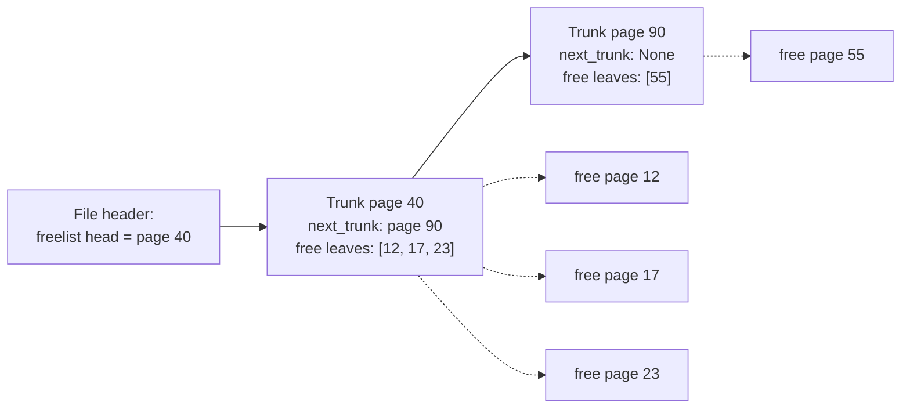
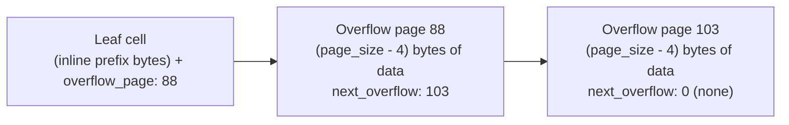

# Subproject 7 — Freelist & Overflow Pages

Two separate problems share this subproject because they're both "what do
we do when a page's fixed size stops being convenient": reclaiming pages
that became empty (so the file doesn't grow forever), and storing payloads
*bigger* than a single page.

## Part 1: the freelist

### The problem

Subproject 6's delete logic frees pages (an emptied-out merged leaf). If you
just... stop using that page number, it becomes a permanent hole — the file
never shrinks, and `allocate_page()` (currently just "append at EOF") would
keep growing the file even while plenty of unused pages sit in the middle
of it, unused forever.

### The classic fix: a linked list of free pages, stored *in* those pages

The elegant trick (which `FILE.md` already gestures at with "freelist trunk
page" / "freelist leaf page") is that a free page has no content of its own
to protect — so you can use its own bytes to store the freelist's linked-list
structure, at zero storage cost. A common two-level scheme:

- A **trunk page** holds: a pointer to the *next* trunk page, plus a list of
  page numbers of **leaf** free pages it "owns."
- **Leaf** free pages are just page numbers recorded in a trunk — genuinely
  empty, available for immediate reuse.



`allocate_page()` becomes: "if the freelist is non-empty, pop a page number
off it (removing it from some trunk's list, possibly freeing the trunk page
itself if it's now empty of leaves and has a next-trunk); otherwise append a
new page at EOF." `free_page(id)` becomes: "push this page number onto the
freelist (into an existing trunk with spare capacity, or by turning the
freed page itself into a new trunk)."

This is conceptually identical to a classic **free list allocator** pattern
you'd find in a malloc implementation or an OS's physical-page allocator —
same problem (reusing fixed-size blocks), same solution shape (a linked list
threaded through the free blocks themselves).

### Why this needs a new header field

To find the freelist at all when reopening a file, *something* fixed and
findable has to point at its head — hence `FILE.md`'s commented-out "pointer
to first Freelist block" header field. This is a good moment to notice a
general truth about on-disk formats: anything the engine needs to find
*before* it has parsed anything else has to live in the one place guaranteed
to be read first — the header.

## Part 2: overflow pages

### The problem

A cell lives inside a page; a page has a fixed, finite size. What happens
when a single value (a long `TEXT` or `BLOB`) is bigger than fits in one
cell, or even bigger than a whole page?

### The classic fix: spill into a chain of dedicated pages

Store as much of the payload as fits inline in the cell, followed by a
pointer to an **overflow page** holding the next chunk — which itself ends
with a pointer to the *next* overflow page if there's still more, and so on,
terminating in a page whose "next" pointer is null/zero.



Reading the value back means: read the inline prefix, then **follow the
chain**, concatenating each overflow page's data bytes, until you hit a null
"next" pointer. This is exactly a **linked list**, just implemented with
page numbers instead of pointers (the same "no `Box`, use `PageId` instead"
idea from Subproject 3's theory) — and it's a nice moment to notice that
you've now implemented the same core idea (free lists, overflow chains) via
page-number-linked-lists twice in one subproject.

Real-world parallel worth knowing: PostgreSQL's **TOAST** mechanism
("The Oversized-Attribute Storage Technique") solves exactly this problem —
large column values get chopped into chunks and stored out-of-line, with
the main row holding a small pointer/reference instead of the full value.
Different bit layout, same underlying idea.

## Rust concepts you'll lean on

### Arena-style linked lists (index-based, not pointer-based)

This is the textbook Rust answer to "I want a linked list but pointer-chasing
structures are painful with the borrow checker" — and it's *exactly* the
shape of both the freelist and the overflow chain, just with a `Pager`
standing in for the "arena." A minimal illustration with an actual in-memory
`Vec`-backed arena (not page-based, just to isolate the pattern):

```rust
struct Arena<T> {
    slots: Vec<Option<T>>,
}

struct NodeId(usize);

struct ListNode {
    value: i32,
    next: Option<NodeId>,
}

impl Arena<ListNode> {
    fn push_front(&mut self, value: i32, head: Option<NodeId>) -> NodeId {
        self.slots.push(Some(ListNode { value, next: head }));
        NodeId(self.slots.len() - 1)
    }

    fn walk(&self, mut current: Option<NodeId>) -> Vec<i32> {
        let mut out = Vec::new();
        while let Some(NodeId(idx)) = current {
            let node = self.slots[idx].as_ref().unwrap();
            out.push(node.value);
            current = node.next.take().or(node.next); // illustrative only
        }
        out
    }
}
```

(Don't worry about that `walk` method's exact correctness — it's purely
illustrating the shape: `Option<NodeId>` as "maybe a next pointer," and
walking it with a `while let` loop instead of recursion.) Your real overflow
chain walk looks the same, with `Option<PageId>` as "next" and
`pager.read_page(id)` standing in for `self.slots[idx]`.

### `while let` for walking a chain

```rust
fn read_overflow_chain(pager: &mut Pager, mut next: Option<u32>) -> anyhow::Result<Vec<u8>> {
    let mut data = Vec::new();
    while let Some(page_id) = next {
        let page = pager.read_page(page_id)?;
        let (chunk, following) = parse_overflow_page(page)?;
        data.extend_from_slice(chunk);
        next = following;
    }
    Ok(data)
}
```

`while let Some(x) = expr` is idiomatic Rust for "keep looping as long as
this produces a value, binding it each time" — precisely the shape of
walking any `Option`-terminated chain, whether it's your freelist or your
overflow chain.

### `Vec::extend_from_slice` for reassembling chunked data

Building up one contiguous `Vec<u8>` out of several page-sized chunks is
exactly `extend_from_slice`'s job (append a slice's bytes to the end,
reallocating the `Vec`'s backing storage as needed) — you'll use this
constantly once overflow chains exist, and again in Subproject 13's CLI
output buffering.

### Testing both halves against each other

A nice integration point: after Subproject 6's delete frees some pages, a
subsequent large-payload insert (needing overflow pages) should visibly
*reuse* those freed page numbers rather than growing the file — a concrete,
checkable prediction ("file size doesn't grow") that ties the freelist and
overflow-page work together in one test, exactly as your plan's checklist
describes.
