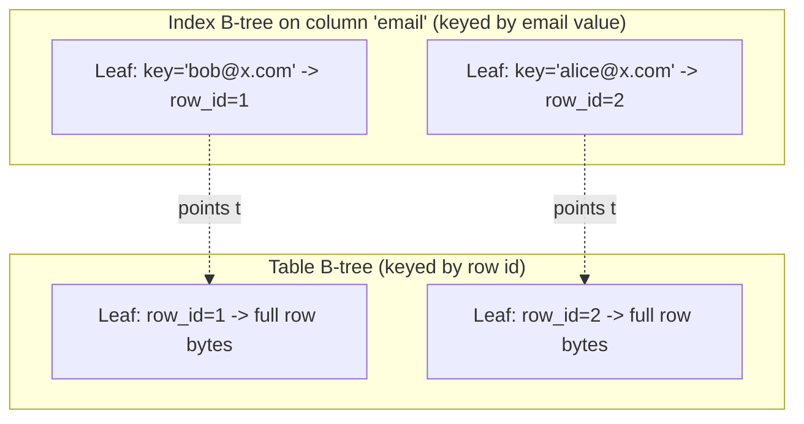
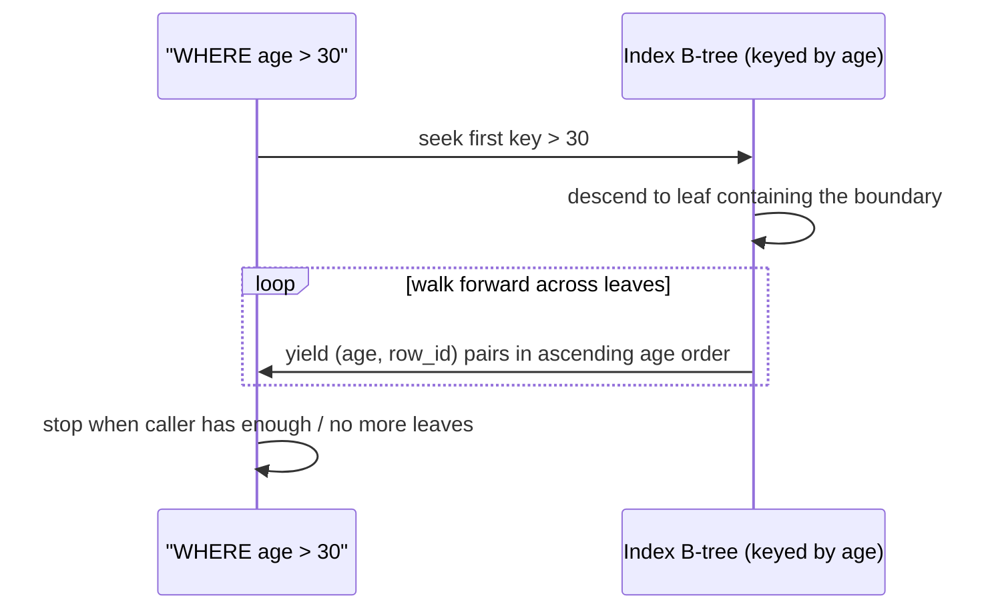

# Subproject 8 — Secondary Indexes (Index B-Trees / B+Trees)

Everything so far has been one B-tree per table, keyed by row id. This
subproject introduces a *second kind* of B-tree — one per index — keyed by
an arbitrary column's value instead, which is what makes `WHERE email =
'x@example.com'` fast without scanning every row.

## Table B-tree vs. index B-tree

| | Table B-tree | Index B-tree |
|---|---|---|
| Leaf key | row id | indexed column's value |
| Leaf payload | the full row (or a pointer to it, if you're not clustering) | just the row id (a pointer back to the table) |
| Purpose | store the data | accelerate lookups by a non-row-id key |



An index lookup is now a **two-hop** operation: search the index B-tree by
the column value to get a row id, then search the table B-tree by that row
id to get the actual row (Subproject 11's planner will give you the choice
of skipping the second hop entirely for index-only queries, but that's an
optimization for later — the two-hop model is the baseline to understand
first).

## Why this is "the B+tree part" of the original learning goal

A **B+tree**, strictly, is a B-tree where *all* data lives in leaves and
interior nodes exist purely to route searches — which both of your trees
already are, by construction, since your interior pages never carry row
payloads. What's specifically new and B+tree-*flavored* about index trees in
particular:

- **Range queries are a first-class use case.** `WHERE age > 30` on an
  index over `age` means: find the first leaf cell with key `> 30`, then
  walk forward through leaves in sorted order, collecting row ids, until
  you hit the end. This is *exactly* why B+trees are the standard choice
  for range-friendly indexes (vs. e.g. a hash index, which is excellent for
  equality lookups but useless for ranges — worth noting as a real design
  tradeoff between index structures, even though you're only building
  B+trees here).
- **Duplicate keys are common** (two rows can have the same `age`), which a
  table tree (unique by construction, since row ids are unique) never has
  to deal with.



## Generalizing your B-tree code over the key type

Your table tree is keyed by `u64` (row id, a fixed, simple, totally-ordered
type). An index tree needs to be keyed by *whatever type the indexed column
is* — an integer, a string, a float, potentially multiple columns
(composite indexes) concatenated together. Two broad designs:

1. **Duplicate the insert/split/delete logic**, specialized for index pages
   (separate types, separate functions from the table-tree versions). More
   code, but each copy stays simple and concrete — a legitimate choice for
   a learning project where seeing both concretely, side by side, is itself
   valuable.
2. **Generalize the existing logic** over a key type/comparator, so one set
   of insert/split/delete functions serves both table and index trees. Less
   duplication, but requires the Rust generics/trait-bound concepts below.

Either is defensible; the theory below is what you need *if* you pick
generalization (which is also good practice for the trait/generics
concepts regardless of which you choose for the index tree itself).

## Rust concepts you'll lean on

### `Ord`/`PartialOrd` — making your own types comparable

Any key type used in a sorted structure needs a total order. For your own
`Value` enum (from Subproject 2) to be usable as an index key, it needs to
implement ordering:

```rust
use std::cmp::Ordering;

#[derive(Debug, Clone, PartialEq)]
enum Value { Int(i64), Text(String) /* ... */ }

impl PartialOrd for Value {
    fn partial_cmp(&self, other: &Self) -> Option<Ordering> {
        Some(self.cmp(other))
    }
}

impl Eq for Value {}

impl Ord for Value {
    fn cmp(&self, other: &Self) -> Ordering {
        match (self, other) {
            (Value::Int(a), Value::Int(b)) => a.cmp(b),
            (Value::Text(a), Value::Text(b)) => a.cmp(b),
            // deciding how to order *across* variants (e.g. Int vs Text)
            // is a real design choice you have to make explicitly
            (Value::Int(_), Value::Text(_)) => Ordering::Less,
            (Value::Text(_), Value::Int(_)) => Ordering::Greater,
        }
    }
}
```

Once a type implements `Ord`, the whole standard library's sorting and
searching machinery (`.sort()`, `binary_search`, `BTreeMap<Value, _>`,
`partition_point`) works on it for free — the same tools from Subproject
3's theory, now usable on arbitrary keys instead of just `u64`.

### Generics with trait bounds, vs. trait objects

Two ways to write "code that works for any ordered key type":

```rust
// Generic, monomorphized: the compiler generates a separate copy of this
// function for every concrete K it's called with (e.g. one for K=u64, one
// for K=Value) — zero runtime overhead, but larger compiled binary, and the
// bound must be known at compile time.
fn find_in_sorted<K: Ord>(items: &[K], target: &K) -> Option<usize> {
    items.binary_search(target).ok()
}

// Trait object: one compiled copy of the function, but every call goes
// through a vtable (a small runtime dispatch cost), and callers pass a
// Box<dyn ...> or &dyn ... instead of a concrete type.
trait KeyCompare {
    fn compare(&self, other: &dyn KeyCompare) -> Ordering;
}
```

For this project, generics (`<K: Ord>`) are almost certainly the better fit
— you know your key types at compile time (there's no scenario where the
key type is only known at runtime), so there's no reason to pay dynamic
dispatch's cost. The trait-object alternative is worth knowing about mainly
so you recognize *when* it would be the right call elsewhere (e.g. plugin
systems, or genuinely heterogeneous collections where the concrete type
really isn't known until runtime).

### Closures as comparators, as a lighter-weight alternative

If you don't want to require `K: Ord` on a type you don't control (or want
a custom order different from the type's natural one — e.g. case-insensitive
text comparison for an index), pass a comparator closure instead:

```rust
fn find_by<T, F>(items: &[T], target: &T, compare: F) -> Option<usize>
where
    F: Fn(&T, &T) -> Ordering,
{
    items.binary_search_by(|item| compare(item, target)).ok()
}

// usage:
let idx = find_by(&rows, &target_row, |a, b| a.age.cmp(&b.age));
```

`Fn(&T, &T) -> Ordering` is a trait bound on *closures* — any function or
closure with that exact signature satisfies it. This is the same mechanism
`Vec::sort_by`/`binary_search_by` use in the standard library, and it's
directly useful if you want one generic B-tree implementation parameterized
by "how do I compare two keys" rather than requiring every key type to
implement `Ord` itself.

### Uniqueness: a design decision, not just a code detail

Decide explicitly: can two leaf cells in an index tree have the *same* key?
If you support `UNIQUE` indexes, an insert that would create a duplicate key
must be rejected (checked *before* mutating anything, or rolled back if
detected mid-insert). If you support non-unique indexes with duplicate keys,
your insert/search logic needs to handle "multiple matches for one key"
(e.g. return an iterator of row ids, not a single one) — and your delete
logic needs a way to identify *which* duplicate to remove (typically: match
on both the key *and* the row id together, not the key alone). Write this
decision down explicitly before implementing — it changes the shape of
several function signatures.
