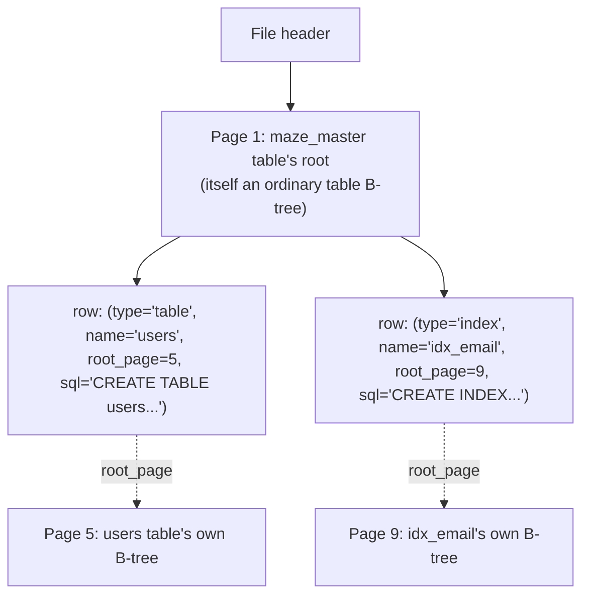
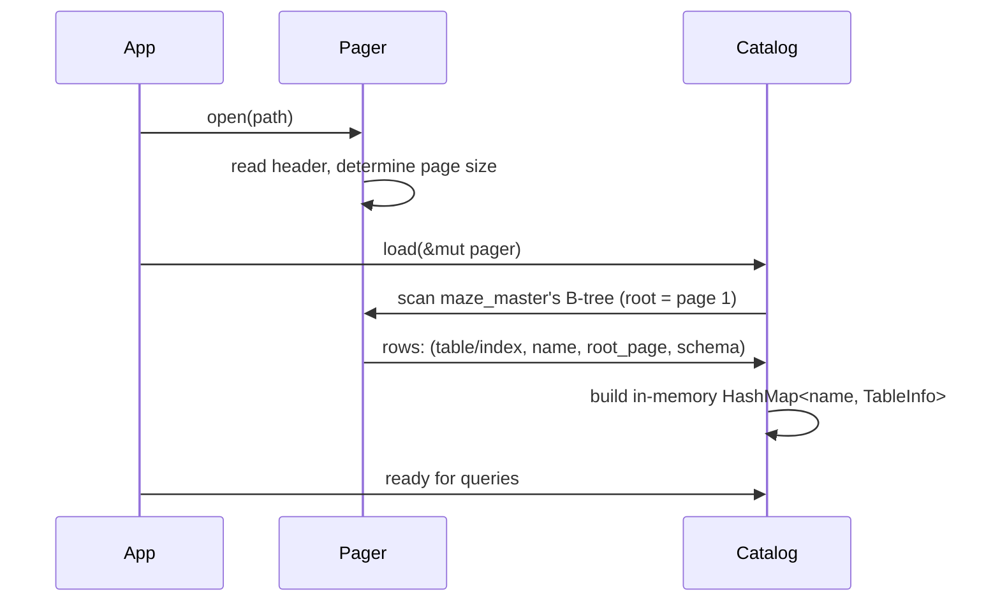

# Subproject 9 — Catalog & Schema

Every piece built so far operates on a B-tree "if you already know its root
page number." Something has to track *which* root page belongs to *which*
table or index, and what columns/types that table has. That something is
the **catalog** — the hinge between "storage engine" (everything before
this) and "SQL layer" (everything after it).

## The bootstrapping idea: the catalog is a table

The elegant trick (borrowed directly from SQLite's `sqlite_master` and
conceptually the same idea behind PostgreSQL's `pg_catalog`): don't invent a
separate, special-cased storage mechanism for schema metadata. Store it as
rows in an ordinary table — your `maze_master` — using **the exact same
B-tree/record machinery** you already built for user tables. One row per
table or index, recording its name, its root page number, and its schema.



This is why Subproject 5's "the root page's number never changes across
splits" detail mattered so much earlier: `maze_master` itself has a root
page too (conventionally page 1, since it has to be *findable* without
consulting... itself), and every other table/index's root page number is
only valid as long as it doesn't silently change underneath the catalog
row pointing at it.

## Opening a database: the load sequence



Note the asymmetry worth internalizing: **schema is cached in memory on
open**, but **data stays on disk**, read through the pager on demand. A
"schema" is small (relative to data) and read constantly (every single
query needs to resolve table/column names), so caching it fully is an easy,
clearly-worth-it call — unlike row data, which you deliberately *don't* try
to hold entirely in memory.

## What the catalog needs to answer

By the time Subproject 11's planner/executor exists, every piece of it will
ask the catalog questions like:

- "Does a table named `users` exist? What's its root page?"
- "Does `users` have a column named `email`? What's its declared type and
  its position (for locating it in a decoded record)?"
- "Is there an index on `users.email`? What's *its* root page?"

Designing the catalog's API around these questions (rather than just
"here's a `Vec` of all rows, go find what you need") is what makes the SQL
layer built on top of it simple.

## Rust concepts you'll lean on

### Designing the schema structs

```rust
struct Column {
    name: String,
    ty: ColumnType, // an enum: Integer, Text, Float, Blob, ...
}

struct TableInfo {
    name: String,
    root_page: u32,
    columns: Vec<Column>,
}

struct IndexInfo {
    name: String,
    root_page: u32,
    table_name: String,
    column_name: String,
}

struct Catalog {
    tables: std::collections::HashMap<String, TableInfo>,
    indexes: std::collections::HashMap<String, IndexInfo>,
}
```

A `HashMap<String, TableInfo>` keyed by table name gives you O(1) "does this
table exist, and what's its info" lookups — exactly the query pattern the
executor will hammer on for every statement.

### Owned `String` keys vs. `&str` — and why owned wins here

You could try to key the `HashMap` by `&str` borrowed from somewhere, but
*from where*? The table name originally lives in bytes decoded from a
`maze_master` row — a temporary buffer that won't necessarily outlive the
`Catalog` struct itself (especially once pages can be evicted from the
pager's cache, or the row gets updated/deleted). Owned `String` sidesteps
the whole question: the `Catalog` *owns* its copy of every name, with no
lifetime tied to any particular page buffer. This is the same "copy to
decouple from a borrowed buffer" reasoning from Subproject 2's `Value::Text`
decision, applied one layer up.

### `Clone` and when sharing schema data is worth an `Rc`

Once the executor (Subproject 11) is composing several plan nodes that each
need to know a table's schema, you'll be passing `TableInfo` around a lot.
Plain `#[derive(Clone)]` + cloning when needed is the simplest correct
starting point — don't reach for `Rc<TableInfo>` (cheap, reference-counted
sharing instead of copying) until you've actually noticed cloning schema
structs (which are small — a handful of strings and an enum per column) is
a real cost. This is a general Rust habit worth having: `Clone` first,
`Rc`/`Arc` only once profiling or obvious repeated-large-clone patterns
justify the extra indirection.

### The `Display` trait for human-readable schema printing

Subproject 13's `.schema` dot-command needs to print a table's structure
readably. Implementing `std::fmt::Display` (rather than only having
`Debug`) is the idiomatic way to give a type a "this is how it should look
to a user" representation, separate from its `{:?}` debug representation:

```rust
use std::fmt;

impl fmt::Display for TableInfo {
    fn fmt(&self, f: &mut fmt::Formatter<'_>) -> fmt::Result {
        write!(f, "CREATE TABLE {} (", self.name)?;
        for (i, col) in self.columns.iter().enumerate() {
            if i > 0 {
                write!(f, ", ")?;
            }
            write!(f, "{} {:?}", col.name, col.ty)?;
        }
        write!(f, ")")
    }
}

// later: println!("{table_info}");   // uses Display
// vs:    println!("{table_info:?}"); // uses derived Debug instead
```

Implementing `Display` is also what makes a type work directly with
`.to_string()` and `format!("{}", ...)` — worth doing for any type you'll
eventually want to show a user, as distinct from types that only ever need
to be inspected by *you* while debugging (which `#[derive(Debug)]` already
covers for free).

### A generic "registry" pattern, generalized beyond the catalog

The `HashMap<String, T>` + load-on-open + query-by-name shape you're
building here is a completely general pattern — the same shape shows up
anywhere you need "a small number of named things, looked up frequently,
cheap to keep fully in memory" (a plugin registry, a config store, a symbol
table in a compiler — which is, incidentally, almost exactly what Subproject
10's parser will need for resolving identifiers against known
tables/columns). Recognizing the catalog as an instance of that general
pattern — not a one-off database-specific mechanism — is useful transferable
insight.
