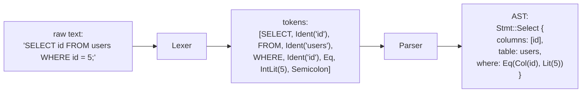
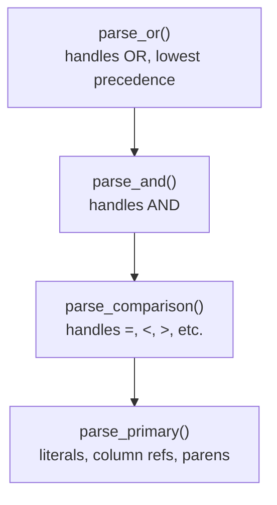

# Subproject 10 — SQL Tokenizer & Parser

Everything below this subproject operates on bytes, pages, and trees — all
things the engine itself defines. Starting here, the engine has to deal with
something it *doesn't* control: text a human typed, which can be malformed,
ambiguous, or just wrong, and has to be rejected cleanly rather than crash
anything.

## The pipeline: text → tokens → AST



Splitting this into two stages (lexer, then parser) rather than one
monolithic "read characters and build an AST" pass is standard practice for
a good reason: the lexer's job (character-level concerns — whitespace,
quoting, what counts as a number) is a completely different kind of problem
from the parser's job (token-level concerns — does this *sequence* of
tokens form a valid statement). Separating them means each stage is simpler
and more testable on its own.

## Lexing: text → tokens

A **token** is the smallest meaningful unit of the language: a keyword
(`SELECT`), an identifier (`users`), a literal (`5`, `'hello'`), or
punctuation (`,`, `(`, `=`). The lexer's job is purely mechanical:
scan characters left to right, group them into tokens, skip whitespace and
comments, and stop (producing an error, not a panic) on something it
doesn't recognize.

```
Input:  SELECT id FROM users WHERE id=5;
         └┬───┘ └┬┘ └┬──┘ └┬──┘ └┬──┘└┬┘└┬┘
      keyword ident keyword ident keyword ident =  int  ;
```

Why this matters for *correctness*, not just structure: a naive
character-by-character parser tends to accidentally conflate lexical and
grammatical concerns (e.g. "is `FROM` ever a valid column name?" — only
answerable cleanly if you've already decided, at the lexer level, that
`FROM` is *always* the `From` keyword token, never an identifier, which is
exactly the kind of reserved-word rule real SQL grammars have to make
explicit).

## Parsing: tokens → AST, via recursive descent

**Recursive descent** parsing means: write one function per grammar rule,
where each function calls the functions for the rules it's built from,
mirroring the grammar's structure directly in code. For a simplified
`SELECT` grammar sketch:

```
select_stmt  := SELECT column_list FROM ident [ where_clause ] [ order_clause ] [ limit_clause ]
column_list  := ident ( ',' ident )*  |  '*'
where_clause := WHERE expr
expr         := term ( (AND | OR) term )*
term         := ident comparator literal
```

Each grammar rule becomes a function:

```rust
fn parse_select(&mut self) -> Result<Stmt, ParseError> {
    self.expect(Token::Select)?;
    let columns = self.parse_column_list()?;
    self.expect(Token::From)?;
    let table = self.expect_ident()?;
    let where_clause = if self.peek() == Some(&Token::Where) {
        self.advance();
        Some(self.parse_expr()?)
    } else {
        None
    };
    // ... order_clause, limit_clause similarly ...
    Ok(Stmt::Select { columns, table, where_clause })
}
```

### Operator precedence: why `expr` needs more care than a flat list

`WHERE a = 1 AND b = 2 OR c = 3` isn't just "a flat sequence of comparisons"
— `AND` binds tighter than `OR` (i.e. this parses as `(a=1 AND b=2) OR
(c=3)`, not left-to-right flatly). The standard technique for this is
**precedence climbing** (a generalization of recursive descent for binary
operators): write one parsing function per precedence level, where each
level's function calls down into the *next tighter* level before combining
results at its own operator.



```rust
fn parse_or(&mut self) -> Result<Expr, ParseError> {
    let mut left = self.parse_and()?;
    while self.peek() == Some(&Token::Or) {
        self.advance();
        let right = self.parse_and()?;
        left = Expr::Or(Box::new(left), Box::new(right));
    }
    Ok(left)
}

fn parse_and(&mut self) -> Result<Expr, ParseError> {
    let mut left = self.parse_comparison()?;
    while self.peek() == Some(&Token::And) {
        self.advance();
        let right = self.parse_comparison()?;
        left = Expr::And(Box::new(left), Box::new(right));
    }
    Ok(left)
}
```

Because `parse_and` is called *from inside* `parse_or`'s loop, every `AND`
chain gets fully parsed and bundled into one `Expr` *before* an enclosing
`OR` ever sees it — which is exactly what gives `AND` its tighter binding,
purely from the call structure, with no explicit precedence numbers needed
at this small a grammar size.

## A worked generic example: arithmetic expression parsing

This exact technique (recursive descent + precedence climbing) is most
commonly taught via arithmetic expressions — worth working through in
isolation before applying it to SQL's `WHERE` clause, since the shape is
identical and arithmetic has no other SQL-specific complexity to distract
from it:

```rust
#[derive(Debug, Clone, PartialEq)]
enum Token { Num(f64), Plus, Minus, Star, Slash, LParen, RParen }

#[derive(Debug)]
enum Expr { Num(f64), Add(Box<Expr>, Box<Expr>), Mul(Box<Expr>, Box<Expr>) }

struct Parser { tokens: Vec<Token>, pos: usize }

impl Parser {
    fn peek(&self) -> Option<&Token> { self.tokens.get(self.pos) }
    fn advance(&mut self) -> Token { let t = self.tokens[self.pos].clone(); self.pos += 1; t }

    // lowest precedence: + and -
    fn parse_additive(&mut self) -> Expr {
        let mut left = self.parse_multiplicative();
        loop {
            match self.peek() {
                Some(Token::Plus) => { self.advance(); left = Expr::Add(Box::new(left), Box::new(self.parse_multiplicative())); }
                _ => break,
            }
        }
        left
    }

    // higher precedence: * and /  (called from parse_additive, so it binds tighter)
    fn parse_multiplicative(&mut self) -> Expr {
        let mut left = self.parse_primary();
        loop {
            match self.peek() {
                Some(Token::Star) => { self.advance(); left = Expr::Mul(Box::new(left), Box::new(self.parse_primary())); }
                _ => break,
            }
        }
        left
    }

    fn parse_primary(&mut self) -> Expr {
        match self.advance() {
            Token::Num(n) => Expr::Num(n),
            Token::LParen => {
                let inner = self.parse_additive(); // parens reset to the lowest precedence level
                self.advance(); // consume RParen
                inner
            }
            t => panic!("unexpected token: {t:?}"), // a real parser returns Result here, not panics
        }
    }
}
```

`1 + 2 * 3` parses as `Add(Num(1), Mul(Num(2), Num(3)))` because
`parse_additive` calls `parse_multiplicative` for each operand — by the time
control returns to the `+` handling in `parse_additive`, the `2 * 3` has
already been fully consumed as one `Expr`. This is the entire trick; your
SQL `WHERE` parser's `AND`/`OR` structure (shown above) is the same
technique with different operators and one more precedence level.

## Rust concepts you'll lean on

### `Peekable` iterators for one-token lookahead

Recursive descent constantly needs to ask "what's the *next* token, without
consuming it yet" (to decide which grammar rule applies). `std::iter::Peekable`
wraps any iterator and adds exactly that:

```rust
let mut tokens = vec![Token::Select, Token::Ident("id".into())].into_iter().peekable();
if tokens.peek() == Some(&Token::Select) {
    tokens.next(); // now actually consume it
}
```

Many hand-written parsers instead hold a `Vec<Token>` + a `pos: usize` index
(as in the worked example above) rather than wrapping an iterator — both are
idiomatic; the index approach makes "peek 2 tokens ahead" and "save/restore
position for backtracking" slightly easier to express than `Peekable`
alone, which only supports peeking exactly one item ahead.

### `chars()`, byte indices, and UTF-8 — a sharp edge worth knowing early

Rust `String`/`&str` are UTF-8 encoded, and **`s[i]` indexing by raw integer
is not allowed** on `str` at all (unlike `[u8]`), precisely because a byte
index might land in the *middle* of a multi-byte character, which would be
nonsensical. For a lexer scanning character by character:

```rust
let sql = "SELECT 'héllo'";
for (byte_idx, ch) in sql.char_indices() {
    // byte_idx is the BYTE offset of `ch`, which may be multi-byte (e.g. 'é' is 2 bytes in UTF-8)
}
```

If you only need ASCII (a very reasonable simplification for a toy SQL
dialect — most real SQL keywords/identifiers are ASCII, and you can treat
non-ASCII bytes inside quoted string literals as opaque data you copy
through without interpreting), working over `sql.as_bytes()` (`&[u8]`) is
simpler and avoids this whole class of concern — worth deciding explicitly
up front which approach you're taking, rather than discovering the UTF-8
subtlety midway through writing the lexer.

### Custom error types for parse errors

Unlike most of the storage engine (where `anyhow::Result` is the right
default per Subproject 0's reasoning), a parser is a good candidate for a
dedicated, structured error type — callers (the REPL in Subproject 13)
genuinely want to distinguish "syntax error at position N, expected X" from
other failure kinds, and want position information to show the user:

```rust
#[derive(Debug)]
struct ParseError {
    message: String,
    position: usize,
}

impl std::fmt::Display for ParseError {
    fn fmt(&self, f: &mut std::fmt::Formatter<'_>) -> std::fmt::Result {
        write!(f, "parse error at token {}: {}", self.position, self.message)
    }
}

impl std::error::Error for ParseError {}
```

Implementing `std::error::Error` (which just requires `Debug` + `Display`,
both shown above) is what lets this type still flow into `anyhow::Result`
elsewhere via `?`, if/when a `ParseError` needs to propagate into code that
otherwise uses `anyhow` — the two approaches aren't mutually exclusive.

### Derived `PartialEq`/`Debug` on `Token`/`Expr`/`Stmt` enums

```rust
#[derive(Debug, Clone, PartialEq)]
enum Token { /* ... */ }
```

`#[derive(PartialEq)]` is what makes `self.peek() == Some(&Token::Where)`
style comparisons (used throughout the examples above) possible at all —
without it, `Token` wouldn't support `==`. `Debug` makes test failures
readable (`assert_eq!` prints both sides via `Debug` on failure). These two
derives are close to "always add them to any enum you'll compare or test,"
unless you have a specific reason not to (e.g. a type containing something
that genuinely can't be compared meaningfully, like a raw file handle).
