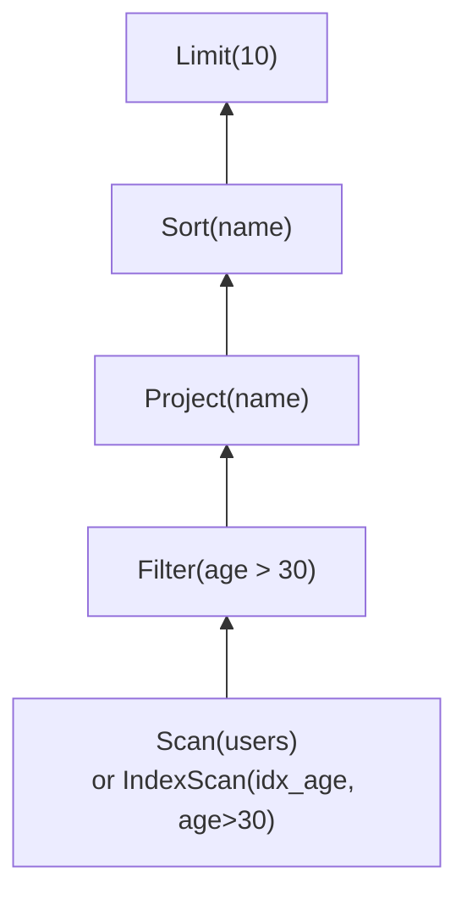
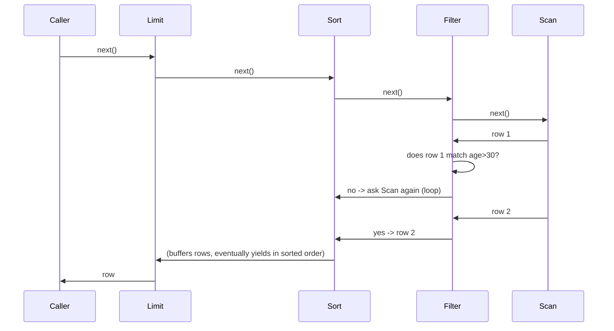

# Subproject 11 — Query Planning & Execution

The AST from Subproject 10 describes *what* the user asked for. This
subproject is about turning that into an actual sequence of storage-engine
operations — and, specifically, structuring that execution as a composable
pipeline of small operators, which is how essentially every real database
engine (and plenty of non-database systems — see below) executes queries.

## Logical plan vs. execution

A **logical plan** is a tree describing *what* needs to happen, independent
of *how* efficiently: "scan `users`, filter by `age > 30`, project just the
`name` column, sort by `name`, keep the first 10." Turning the AST into this
tree is the **planner**'s job. Actually producing rows from it is the
**executor**'s job.



## The planner's one real decision (for this project): scan or index?

A full **table scan** reads every row and checks the filter — correct but
potentially slow (O(n) rows touched regardless of how selective the filter
is). An **index scan** uses an existing index B-tree to jump straight to
the matching rows — fast, but only usable *if* a suitable index exists.
Your plan's "trivial planner" heuristic: for `WHERE col = <literal>`, check
the catalog (Subproject 9) for an index on `col`; use it if present,
otherwise fall back to a scan+filter. Real query planners (PostgreSQL,
etc.) do vastly more here — cost estimation using table statistics,
considering multiple candidate plans and picking the cheapest, join
ordering — all worth knowing *exists* as the next level of depth, without
needing to implement any of it for this project to be a genuine, working
example of the same idea at its core.

## The Volcano / iterator execution model

The classic (and still dominant) model for relational execution — often
called the **Volcano model** or **iterator model** — represents every step
of a plan as an operator exposing one method: "give me the next row, or
tell me there are no more." Operators are composed by having each one pull
from the operator below it:



The elegant property: **each operator only needs to know about its own
logic and the one operator directly below it** — `Filter` doesn't know or
care whether its input is a raw scan or another filter or a sort; it just
calls `.next()` on "whatever its input is" and applies its predicate. This
is what makes operators composable: any operator can sit on top of any
other operator that produces the same kind of rows.

This is also, not coincidentally, almost exactly how Rust's own `Iterator`
combinators (`.filter()`, `.map()`, `.take()`) work — `iter.filter(f).map(g).take(10)`
is the Volcano model, already built into the standard library, for the
single-threaded, single-stream, in-memory case. Recognizing a query plan as
"the same idea, with operators that can be backed by disk I/O instead of
just RAM" is the single most useful conceptual bridge in this subproject.

## Rust concepts you'll lean on

### Defining your own operator trait (mirroring `Iterator`)

```rust
type Row = Vec<Value>;

trait RowSource {
    fn next(&mut self) -> anyhow::Result<Option<Row>>;
}
```

This is deliberately shaped like `Iterator` (`fn next(&mut self) -> Option<Self::Item>`)
but returns `anyhow::Result<Option<Row>>` instead of plain `Option<Row>`,
because every step here can genuinely fail (a page read can error, a record
can fail to decode) — something `Iterator::next`'s signature has no room
for. This is a common, well-known limitation people run into trying to use
real `Iterator` for fallible sources, and "wrap `Result` around the
`Option`" is the standard workaround.

### Composing operators via ownership (static dispatch)

```rust
struct Scan { cursor: Cursor }
impl RowSource for Scan {
    fn next(&mut self) -> anyhow::Result<Option<Row>> {
        self.cursor.next_row() // whatever your cursor's method is called
    }
}

struct Filter<S: RowSource> {
    input: S,
    predicate: Box<dyn Fn(&Row) -> bool>,
}

impl<S: RowSource> RowSource for Filter<S> {
    fn next(&mut self) -> anyhow::Result<Option<Row>> {
        loop {
            match self.input.next()? {
                Some(row) if (self.predicate)(&row) => return Ok(Some(row)),
                Some(_) => continue, // didn't match, try the next row from input
                None => return Ok(None),
            }
        }
    }
}
```

`Filter<S: RowSource>` is generic over its input operator's concrete type —
`Filter<Scan>`, `Filter<IndexScan>`, even `Filter<Filter<Scan>>` are all
distinct, fully concrete types the compiler specializes at compile time
(monomorphization, same idea as Subproject 8's generics discussion). This
is "static dispatch": fast, but the concrete plan shape has to be nameable
in your code.

### Why a dynamically-typed plan tree needs `Box<dyn RowSource>` instead

The planner builds a plan shape that depends on *runtime* information (does
this query have a `WHERE`? an `ORDER BY`? a `LIMIT`? does an index exist?)
— the concrete nested generic type of "the final composed operator" isn't
knowable at compile time; it varies query to query. This is exactly the
scenario where a **trait object** earns its runtime-dispatch cost:

```rust
fn build_plan(/* ... */) -> Box<dyn RowSource> {
    let mut plan: Box<dyn RowSource> = Box::new(Scan { cursor: /* ... */ });
    if let Some(predicate) = where_predicate {
        plan = Box::new(Filter { input: plan, predicate: Box::new(predicate) });
    }
    // if let Some(...) = order_by { plan = Box::new(Sort { input: plan, ... }); }
    // if let Some(n) = limit { plan = Box::new(Limit { input: plan, n }); }
    plan
}
```

Note `Filter { input: plan, ... }` here takes `plan: Box<dyn RowSource>` as
its `input` — meaning `Filter`'s own definition needs to accept *either* a
concrete generic `S: RowSource` *or* `Box<dyn RowSource>` depending on
which composition style you're using at that call site. In practice, once
you're building plans dynamically like this, it's simplest to make every
operator's `input` field typed as `Box<dyn RowSource>` uniformly, rather
than mixing both styles — accept the small, constant per-`next()`-call
vtable dispatch cost in exchange for a plan tree whose shape can vary
freely at runtime. This is the right tradeoff here: query execution is
already dominated by page I/O cost, so vtable dispatch overhead is noise by
comparison — a good concrete example of *when* dynamic dispatch's cost
genuinely doesn't matter, contrasting with Subproject 8's advice to prefer
generics for the B-tree key-comparison hot path, where it does.

### `Box<dyn Fn(...)>` for predicates and other runtime-supplied logic

A `WHERE` clause's predicate is itself something only known at *query* time
(parsed from user SQL), not something your `Filter` struct's definition can
hardcode — so it's naturally a boxed closure, exactly like the plan nodes
themselves: `Box<dyn Fn(&Row) -> bool>` is "some callable thing, decided at
runtime, that the `Filter` operator stores and calls repeatedly."
