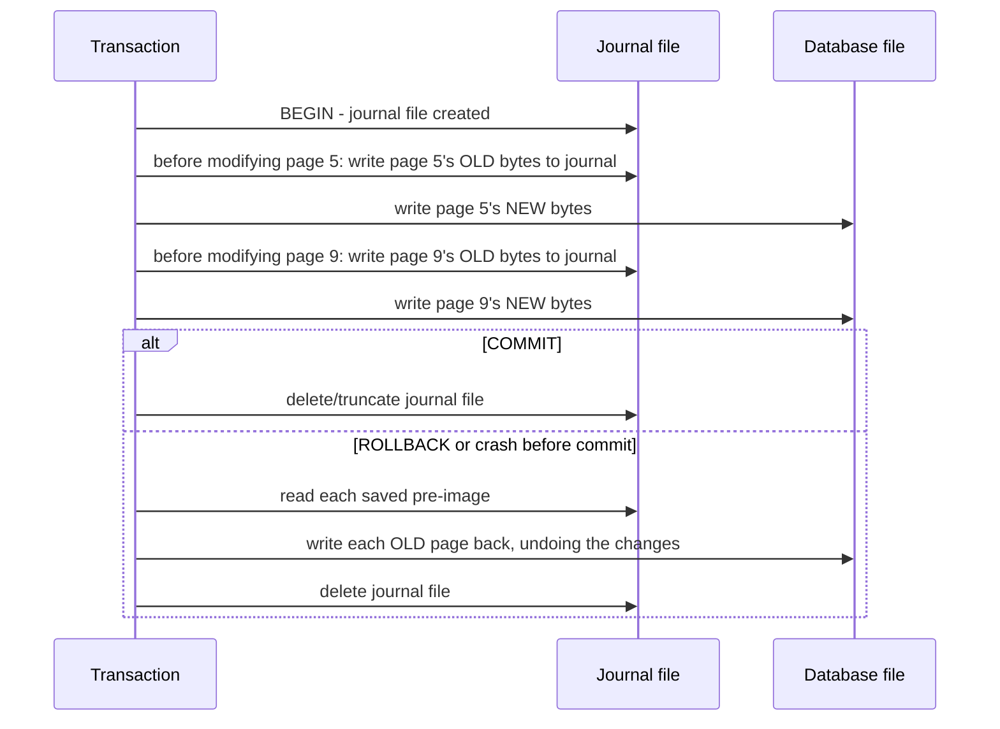
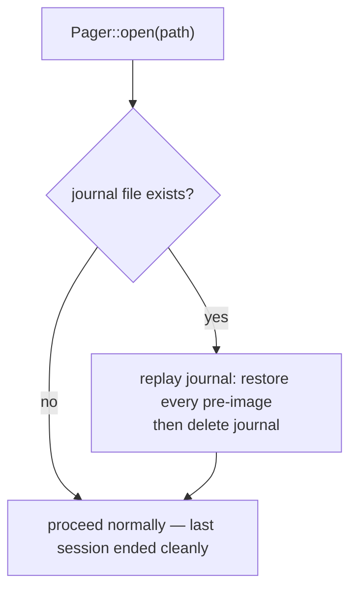

# Subproject 12 — Transactions & Durability

Everything so far assumes a page write either fully happens or the program
is still running to try again. Real systems crash mid-write — power loss,
a process kill, a panic. This subproject is about making the database
survive that without becoming internally inconsistent (e.g. a B-tree split
that wrote the new sibling page but never finished updating the parent).

## ACID, scoped to what this project actually tackles

The textbook four properties:

- **Atomicity** — a transaction's writes happen entirely, or not at all.
- **Consistency** — a transaction can't leave the database violating its
  own invariants (largely a consequence of the engine being implemented
  correctly elsewhere — not a separate mechanism).
- **Isolation** — concurrent transactions don't see each other's
  in-progress changes. (Out of scope here — your plan's stretch goals cover
  concurrency; a single-writer, single-threaded engine gets isolation for
  free by construction, since there's never more than one transaction in
  flight.)
- **Durability** — once a transaction reports "committed," its effects
  survive a subsequent crash.

Subproject 12 is really about **atomicity + durability** together: making
sure that a crash at *any* point mid-write leaves you either with all of a
transaction's effects, or none of them — never a half-applied split or a
half-written record.

## Why write-back caching (Subproject 4) makes this a real problem

Your pager keeps modified pages in memory and only writes them to disk
later. That means at any given moment, "what's on disk" and "what the
in-memory cache believes is true" can disagree — which is fine, *until* the
process dies in between. The rollback journal is the mechanism that makes
that gap safe to crash inside of.

## The rollback journal (undo logging) approach

This is SQLite's original (pre-WAL) durability mechanism, and the more
approachable one to implement by hand — the core idea: **before you
overwrite a page for the first time within a transaction, save its old
contents (the "pre-image") to a separate journal file.** If the transaction
completes, discard the journal (nothing more to undo). If it doesn't
complete — explicit rollback, or a crash — replay the journal to restore
every touched page to how it was before the transaction started.



### Why this specifically survives a crash, not just a clean rollback

The critical property: **the existence of the journal file itself is the
signal that a transaction was in progress.** On `Pager::open`, before doing
anything else, check: does a journal file exist from a previous run? If so,
the previous process died mid-transaction (it never got to the "delete the
journal" step, which only happens on a clean commit or rollback) — replay
it exactly as a rollback would, *then* proceed with opening normally. This
is why "delete the journal" has to be the *last* step of commit, after
every page write has actually landed on disk: it's the single bit of state
answering "did the last session finish cleanly."



### A subtlety worth flagging explicitly: write ordering

For this to actually be crash-safe, the pre-image write to the journal must
be **durably on disk** *before* the corresponding new page write — otherwise
a crash between them could lose the very pre-image you needed to recover.
Real systems handle this with explicit `fsync`/flush calls at the right
points (and worry about the OS/disk's own write-ordering guarantees, a deep
rabbit hole of its own). For a learning implementation, it's enough to
understand *why* ordering matters here and to write your flush calls in the
right sequence — you don't need to chase every OS-level durability guarantee
to get the conceptual lesson right. Note this as an explicit, named
simplification versus a production engine.

## Rust concept: RAII guards and the `Drop` trait for "undo by default"

This is a genuinely elegant fit between Rust's ownership model and
transaction semantics, worth dwelling on. The idea: model an in-progress
transaction as a *value* whose lifetime corresponds to the transaction's
lifetime, and use `Drop` to express "if this value goes out of scope without
being explicitly committed, roll back automatically":

```rust
struct Transaction<'p> {
    pager: &'p mut Pager,
    committed: bool,
}

impl<'p> Transaction<'p> {
    fn begin(pager: &'p mut Pager) -> anyhow::Result<Self> {
        pager.start_journal()?;
        Ok(Transaction { pager, committed: false })
    }

    fn commit(mut self) -> anyhow::Result<()> {
        self.pager.flush()?;
        self.pager.discard_journal()?;
        self.committed = true;
        Ok(())
        // `self` is dropped at the end of this function; `committed` is now true,
        // so Drop below does nothing.
    }
}

impl<'p> Drop for Transaction<'p> {
    fn drop(&mut self) {
        if !self.committed {
            // best-effort: roll back. Can't return a Result from drop(), so
            // log/handle the error rather than propagating it.
            let _ = self.pager.rollback_from_journal();
        }
    }
}
```

With this shape, **forgetting to call `.commit()` is automatically a
rollback**, not a bug — if an early `?` return exits a function mid-transaction
(say, a validation error after a few writes), the `Transaction` value simply
goes out of scope, `Drop::drop` runs, and the journal gets replayed. This is
the same RAII pattern as a mutex guard (`MutexGuard` auto-unlocking on
drop) or a file handle (auto-closing on drop) — "acquire a resource/liability
in a constructor-like function, release/resolve it automatically when the
guarding value's scope ends" — applied to "a transaction that must be
resolved one way or the other."

### Type states: making "commit twice" a compile error, not a runtime one

Notice `commit(mut self)` takes `self` **by value**, not `&mut self` — this
is deliberate and important: it **consumes** the `Transaction`, meaning
after calling `.commit()`, the variable is gone; the compiler will refuse to
let you call `.commit()` (or anything else) on it again. This is "making
invalid states unrepresentable" via the type system, sometimes called the
**type-state pattern** — rather than a runtime check (`if self.committed {
return Err(...) }`) guarding against double-commit, the *type system itself*
makes a second commit a compile error. This is a recurring, powerful Rust
idiom worth internalizing well beyond this project: when an operation
should only happen once, prefer consuming `self` over a boolean flag you
have to remember to check everywhere.

### A smaller, generic illustration of the same `Drop`-guard idea

If the transaction example above feels like a lot at once, the core trick
in isolation, applied to something trivial:

```rust
struct PrintOnDrop(&'static str);

impl Drop for PrintOnDrop {
    fn drop(&mut self) {
        println!("cleaning up: {}", self.0);
    }
}

fn demo() {
    let _guard = PrintOnDrop("scope exit");
    println!("doing work...");
    // _guard.drop() runs automatically here, however this function exits —
    // normal return, early `return`, or even a panic unwinding through it.
}
```

The "however this function exits" part is the whole point: `Drop` runs on
**every** path out of scope, including early returns and panics (during
unwinding) — which is exactly the robustness property you want from
"roll back if anything went wrong," without having to remember to call
rollback explicitly at every possible early-exit point in your transaction
code.
