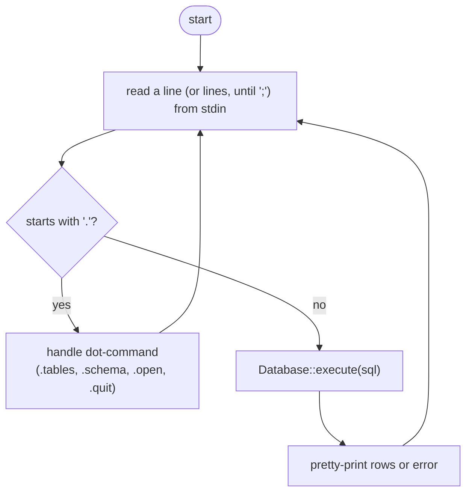
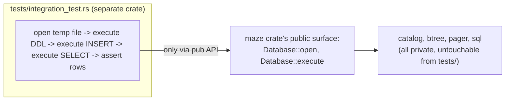

# Subproject 13 — CLI / REPL and Integration

Every layer so far has been tested in isolation. This subproject wraps them
in an interactive front end and, just as importantly, writes the
integration tests that exercise the *whole* stack together — the real test
of whether all the pieces actually fit.

## REPL architecture

**REPL** = Read, Eval, Print, Loop — the same shape as a Python/Node/`sqlite3`
interactive shell. The loop:



### Multi-line statement buffering

SQL statements can span multiple lines before the terminating `;`. The
REPL needs to accumulate input across `read_line` calls until it sees a
statement-ending `;`, rather than assuming one line = one statement:

```
maze> CREATE TABLE users (
 ...>   id INTEGER,
 ...>   name TEXT
 ...> );
```

This is a small but easy-to-get-wrong bit of state machine logic: keep a
growing `String` buffer, append each line, and only hand the buffer to the
parser once it ends (after trimming) with `;` — then clear the buffer for
the next statement.

### Dot-commands vs. SQL

The leading-`.` convention (borrowed directly from the real `sqlite3` CLI)
is a simple, unambiguous way to distinguish "commands to the shell itself"
from "SQL for the database to execute," since `.` is never valid at the
start of a SQL statement. `.tables` and `.schema` are themselves small
consumers of the Subproject 9 catalog — a nice demonstration that the
catalog's API, designed around "what does the planner need to ask," also
happens to answer "what does a human want to see."

## Why integration tests belong in `tests/`, revisited

Subproject 0 introduced the unit-vs-integration-test distinction; this is
where it pays off concretely. An integration test in `tests/` can *only*
call your crate's `pub` API — which means writing one forces you to ask "is
`Database::execute(sql) -> QueryResult` actually sufficient for an external
caller to do everything the REPL needs?" If it isn't, that's a signal your
public API is missing something, caught by the test infrastructure itself
rather than discovered later by a real user (or by the REPL code needing to
reach into private internals, which `tests/*.rs` physically cannot do).



## Rust concepts you'll lean on

### Reading lines from stdin

```rust
use std::io::{self, BufRead, Write};

fn repl() -> anyhow::Result<()> {
    let stdin = io::stdin();
    let mut buffer = String::new();
    print!("maze> ");
    io::stdout().flush()?; // stdout is often line-buffered; flush to show the prompt before input

    for line in stdin.lock().lines() {
        let line = line?;
        buffer.push_str(&line);
        buffer.push('\n');

        if buffer.trim_end().ends_with(';') {
            // dispatch `buffer` as a complete statement, then:
            buffer.clear();
            print!("maze> ");
        } else {
            print!(" ...> ");
        }
        io::stdout().flush()?;
    }
    Ok(())
}
```

`stdin.lock()` acquires exclusive access to stdin for the duration of the
loop (stdin is globally shared and normally guarded for thread-safety; for a
single-threaded REPL this is a formality, but it's required to call
`.lines()`). `.lines()` yields `io::Result<String>` per line, already
handling the buffering — no manual byte-reading needed.

### Column-aligned table printing with format width specifiers

```rust
fn print_table(headers: &[&str], rows: &[Vec<String>]) {
    let mut widths: Vec<usize> = headers.iter().map(|h| h.len()).collect();
    for row in rows {
        for (i, cell) in row.iter().enumerate() {
            widths[i] = widths[i].max(cell.len());
        }
    }

    for (i, h) in headers.iter().enumerate() {
        print!("{:<width$} ", h, width = widths[i]);
    }
    println!();

    for row in rows {
        for (i, cell) in row.iter().enumerate() {
            print!("{:<width$} ", cell, width = widths[i]);
        }
        println!();
    }
}
```

`{:<width$}` means "left-align, pad to `width` characters" where `width` is
itself a *runtime* value supplied via the named argument `width = widths[i]`
— the `$` syntax lets a format specifier's width come from a variable
instead of being a fixed literal. This is the whole trick behind readable
tabular CLI output: compute each column's max content width first, then
format every cell to that width.

### User-facing error reporting via `Display`, not `Debug`

A parse error or catalog error dumped with `{:?}` looks like
`ParseError { message: "expected FROM", position: 12 }` — fine for you
while developing, bad for a user. The REPL's top-level error handling
should print via `{}` (`Display`), relying on every error type in the
stack (per Subproject 10's `ParseError` example, and `anyhow::Error`, which
also implements `Display` nicely by default) having a human-readable
rendering:

```rust
match db.execute(&buffer) {
    Ok(result) => print_table(&result.headers, &result.rows),
    Err(e) => eprintln!("Error: {e}"), // {e} uses Display — readable, not a struct dump
}
```

Printing errors to `stderr` (`eprintln!`) rather than `stdout` (`println!`)
is a small but real Unix convention worth following: it keeps error
messages separable from normal output if someone pipes/redirects the two
streams differently.

### Structuring the final end-to-end test

```rust
// tests/full_stack.rs
use std::process::Command; // if driving the compiled binary directly, OR:
// use maze::Database;      // if calling your library API directly — prefer this when possible

#[test]
fn ddl_dml_query_round_trip() {
    let path = temp_db_path("full_stack"); // from Subproject 4's theory
    let mut db = maze::Database::open(&path).unwrap();

    db.execute("CREATE TABLE users (id INTEGER, name TEXT);").unwrap();
    db.execute("INSERT INTO users VALUES (1, 'alice');").unwrap();
    db.execute("INSERT INTO users VALUES (2, 'bob');").unwrap();

    let result = db.execute("SELECT name FROM users WHERE id = 2;").unwrap();
    assert_eq!(result.rows, vec![vec!["bob".to_string()]]);

    drop(db); // ensure everything's flushed/closed
    let mut reopened = maze::Database::open(&path).unwrap();
    let result = reopened.execute("SELECT name FROM users ORDER BY id;").unwrap();
    assert_eq!(result.rows, vec![vec!["alice".to_string()], vec!["bob".to_string()]]);
}
```

Testing via the library API directly (`maze::Database`) rather than
spawning the compiled binary as a subprocess and scraping its stdout is
almost always the better choice when your logic is *also* exposed as a
library (which `main.rs`/`src/bin/maze.rs` calling into `lib.rs` naturally
gives you) — it's faster, gives you real `Result`s instead of parsed text
output, and is a good forcing function to actually structure the project as
a library + a thin binary front end, rather than one big `main.rs`.
