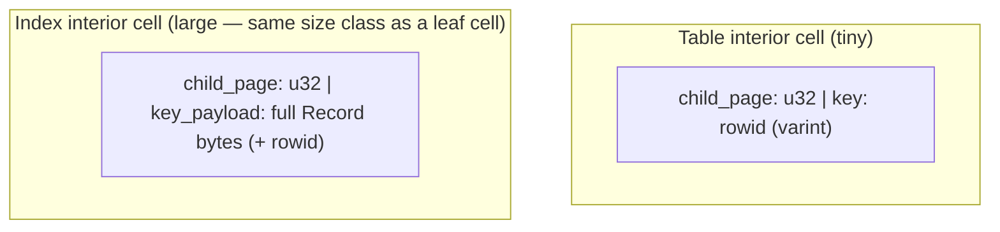
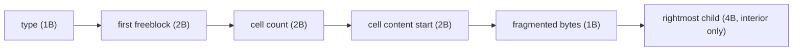
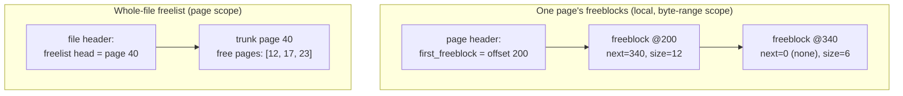
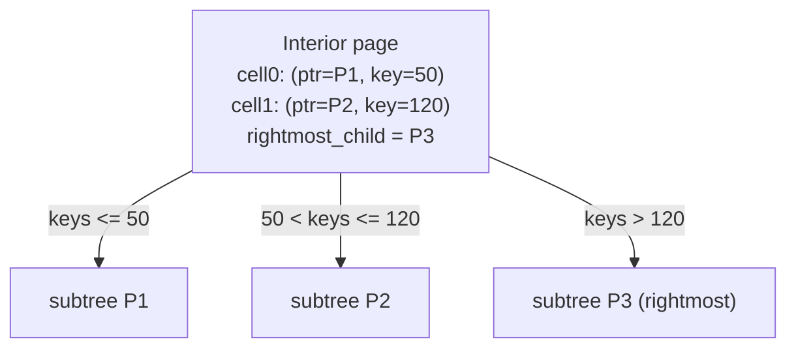
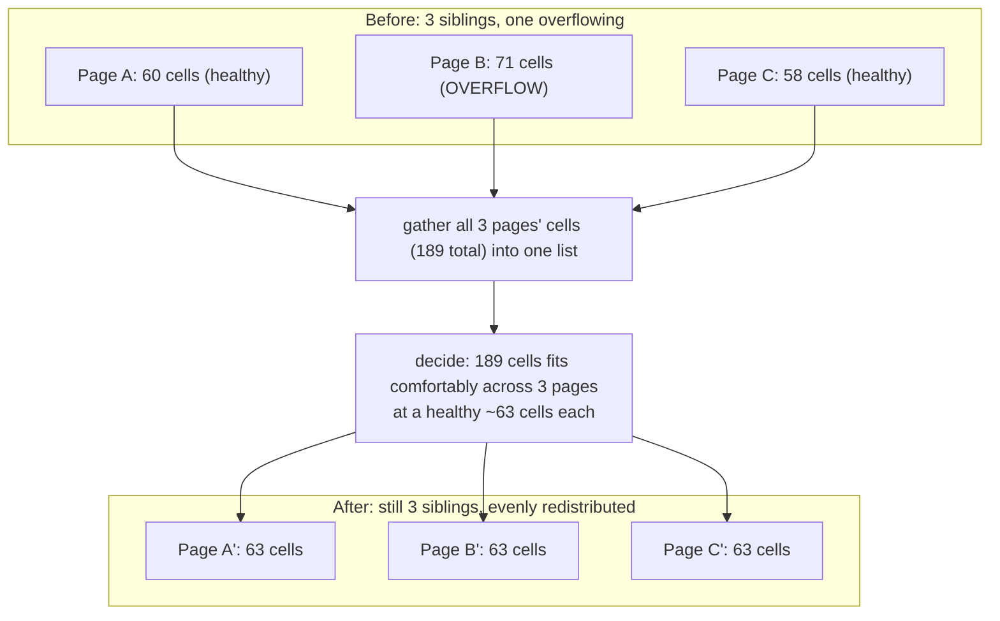
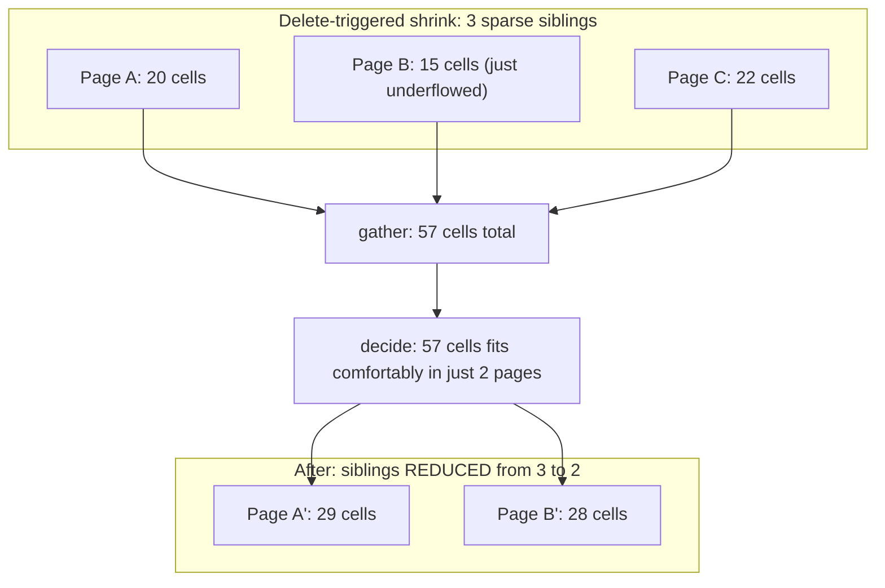
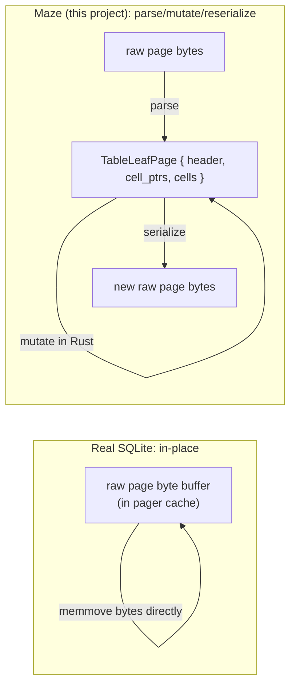

# B-Trees and B+Trees — A Deep Dive

This file is a standalone, consolidated reference on the data structure
itself: what SQLite's b-trees actually look like, exactly how they're laid
out in bytes, and exactly what their balancing algorithm does — in more
depth than any single subproject file covers, because the structure spans
several subprojects and is worth understanding as one coherent whole.

**How this relates to the per-subproject files:** `03-btree-read-path.md`,
`05-btree-insert-split.md`, `06-delete-rebalancing.md`, and
`08-secondary-indexes.md` each teach *just enough* of this structure to
implement that subproject, plus the Rust concepts each one needs — and each
one also recommends a **deliberately simplified** version of the real
algorithm (a single 2-way split instead of SQLite's sibling-gathering
rebalance; merge-only-on-empty instead of borrow-and-merge). This file
describes the **full, real structure**, including the parts the plan
intentionally simplifies away, so you understand what you're simplifying
and why, and have a reference to come back to if you ever want to implement
the real algorithm as a stretch goal. Section 13 maps every piece back to
the specific subproject it matters for.

---

## 1. Terminology, precisely

- **B-tree**: a balanced tree where each node holds multiple keys/children
  (high fanout), and data can live in both interior and leaf nodes.
- **B+tree**: a B-tree variant where interior nodes hold **only** routing
  keys and child pointers — **no data** — and all actual data lives in the
  leaves. Leaves are typically linked for fast ordered range scans.
- **What SQLite actually calls things**: the SQLite source and docs call
  *everything* a "b-tree" — `btree.c`, "table b-tree," "index b-tree" — even
  though, structurally, SQLite's table trees are B+trees (interior pages
  carry zero row data, exactly the B+tree definition). This project follows
  that same loose convention: when this plan or these files say "B-tree,"
  they usually mean the SQLite-style structure, which is technically a
  B+tree for table trees. It's worth knowing the precise distinction exists,
  and also worth not being surprised that "the literature" and "SQLite's own
  naming" don't agree on which word to use.

---

## 2. The four page kinds, and what a "cell" contains in each

Every b-tree page is one of exactly four kinds. The kind determines the
cell format used on that page.

| Page kind | Holds | Cell contents |
|---|---|---|
| Table leaf | actual rows | `rowid` (the key) + the row's payload (a `Record`) |
| Table interior | routing only | a child page pointer + an integer key |
| Index leaf | actual index entries | the index key's payload (a `Record`) + the `rowid` it points at |
| Index interior | routing only | a child page pointer + **the same key payload as an index leaf cell** |

The asymmetry in that last row is the single most important structural fact
to internalize about index trees, and it's easy to miss: **table interior
cells are tiny** (just an integer + a page number — SQLite packs this into
as little as 5-9 bytes), but **index interior cells are nearly as large as
index leaf cells**, because routing on an arbitrary typed key (a string, a
float, a multi-column composite key) requires the *actual key value* to
compare against, not just a magnitude check like a bare integer rowid. One
direct consequence: **index interior pages have meaningfully lower fanout
than table interior pages**, because each of their cells costs much more
page space. A table tree over a billion rows might need 3-4 levels; an
index tree over the same billion rows, with a wide text key, can need
noticeably more, purely because fewer separator cells fit per page.



---

## 3. Page layout, in bytes

Every page (after any file-header bytes on page 1) starts with a **page
header**, followed by a **cell pointer array**, with a **cell content
area** at the far end of the page. The region between them is the page's
free space.

```
┌──────────────┬───────────────────────┬─────────────┬──────────────────────┐
│ PAGE HEADER   │  CELL POINTER ARRAY   │  (free      │   CELL CONTENT AREA   │
│ (fixed size)  │  (grows ->)           │   space)    │   (<- grows)          │
└──────────────┴───────────────────────┴─────────────┴──────────────────────┘
low addresses                                                   high addresses
```

- The **cell pointer array** is a list of 2-byte offsets, **one per cell,
  kept sorted by key** (ascending), growing from right after the header
  toward higher addresses as cells are added.
- The **cell content area** holds the actual cell bytes, growing from the
  **end of the page backward** toward lower addresses as cells are added
  (new cells are appended at progressively lower offsets than the previous
  cell content area start).
- Growing from opposite ends toward each other is what makes "does this
  page still have room" a single subtraction: free space = (content area
  start offset) − (end of pointer array offset). When that gap can't fit a
  new cell's bytes *plus* its new 2-byte pointer-array entry, the page is
  full and must be rebalanced (Section 9).

### Page header fields (interior pages have one extra field)

| Offset | Size | Field | Meaning |
|---|---|---|---|
| 0 | 1 | page type | which of the 4 kinds this page is |
| 1 | 2 | first freeblock offset | head of this page's local free-space list (0 if none) — see Section 4 |
| 3 | 2 | cell count | how many cells are on this page |
| 5 | 2 | cell content area start | where the content area currently begins |
| 7 | 1 | fragmented free bytes | bytes of free space too small/scattered to be a tracked freeblock |
| 8 | 4 | **rightmost child pointer** (interior pages only) | the child covering keys greater than every separator on this page |

Leaf page headers are 8 bytes; interior page headers are 12 bytes (the
extra 4-byte rightmost-child pointer). Your current `PageHeader` in
`page.rs` already models `cell_count`, `cell_content_offset`, and
`rightmost_child` — it's missing the **first freeblock offset** and
**fragmented free bytes** fields, which don't matter yet (nothing deletes
cells yet) but become essential the moment Subproject 6 needs to reclaim
space a deleted cell left behind. See Section 4.

### Page header, at a glance



---

## 4. Freeblocks — a page's *local* free-space list (not the whole-file freelist!)

These two concepts share the word "free" and are easy to conflate — they
operate at completely different scopes:

- A **freeblock** is a gap **inside one page**, left behind when a cell is
  deleted from that page (or shrunk). Freeblocks form a **singly linked
  list embedded in the page's own unused bytes**: each freeblock's first 4
  bytes are `(next_freeblock_offset: u16, size: u16)`, chained from the
  page header's "first freeblock offset" field. When inserting a new cell,
  the page first checks this list for a gap big enough to reuse before
  carving new space off the cell content area. Over time, repeated
  delete/insert cycles can leave many small, scattered freeblocks too tiny
  individually to satisfy a new cell — at that point the page needs
  **defragmentation**: compact every live cell toward one end, rebuild a
  single contiguous free region, and reset the freeblock list. The
  "fragmented free bytes" header field tracks free space *too small to be
  a trackable freeblock at all* (typically gaps smaller than 4 bytes).
- The **freelist** (Subproject 7) is a list of entire **free pages across
  the whole database file** — pages that used to be b-tree nodes (or
  overflow pages) but are now completely unused, threaded together via
  trunk pages, as described in `07-freelist-overflow-pages.md`.



The plan's checklist doesn't require implementing page-local freeblock
reuse — it's reasonable, for a learning project, to just defragment (or
even just leak the gap and compact lazily) rather than building the full
freeblock-list machinery. Knowing it exists, and why real engines bother
with it (avoiding a full-page compaction on every single delete), is the
useful part even if you simplify the implementation.

---

## 5. What an interior cell's key actually means

This is the detail that makes B-tree search work and is easy to get
backwards. An interior page has **N cells plus one extra "rightmost child"
pointer** (from the page header, not a cell). Cell *i* holds
`(child_pointer, key)`, and the meaning is:

> **Every key in `child_pointer`'s subtree is ≤ `key`.** The rightmost
> child (the header field, not a cell) covers everything greater than the
> largest key on the page.



For a **table** interior cell, `key` is just an integer rowid — concretely,
SQLite sets it to **the largest rowid present anywhere in that cell's left
subtree** (not an arbitrary midpoint — the *actual* maximum). That choice
matters for Subproject 5: when you split a leaf, the correct separator to
push into the parent is simply "the largest key that ended up in the left
(lower) half of the split," because that's exactly what the invariant
above requires.

For an **index** interior cell, `key` is the full index-key payload (same
shape as an index leaf's key) — comparison uses whatever ordering the
indexed column(s) use (Section 2's fanout note follows directly from this).

---

## 6. Search, precisely

Descent is: at each interior page, find the first cell whose key is `≥` the
search target (binary search over the sorted cell-pointer array — see
`03-btree-read-path.md` for the `partition_point` technique); if none
qualifies, follow the rightmost-child pointer instead; recurse into the
chosen child; repeat until you reach a leaf, then search the leaf's cells
directly for an exact match (point lookup) or just start reading them in
order (full scan).

---

## 7. Insertion and overflow detection, byte-accurately

To insert a cell: (1) find the correct leaf via search, (2) check whether
it fits — `cell_bytes + 2 (new pointer-array entry) ≤ free space` *after*
first trying to satisfy it from an existing freeblock big enough (Section
4) — (3) if it fits, splice the new pointer into the sorted pointer array
at the right sorted position and write the cell bytes into (reused or
fresh) content-area space, incrementing cell count, and you're done. If it
doesn't fit even after checking freeblocks and defragmenting, the page must
be **rebalanced** — Section 9.

---

## 8. The real balancing algorithm: `balance()`

This is the part most tutorials wave away as "split the node in two." Real
SQLite's actual algorithm is meaningfully more sophisticated, and it's
worth seeing the real thing even though this project's plan deliberately
implements a simpler version (Section 13 explains exactly where and why).

SQLite's balancing has **three distinct routines**, dispatched based on the
situation:

### `balance_quick` — the fast path

Trigger: the overflowing page is the **rightmost child** of its parent, and
the overflow is a single cell being appended at the very end (the common
case of inserting **strictly ascending keys**, e.g. auto-incrementing
rowids — an extremely common real-world pattern). In this case, SQLite
doesn't bother examining siblings at all: it allocates exactly **one** new
page, moves roughly half the overflowing page's cells into it, and inserts
one new separator into the parent. This is the cheap, common case,
optimized separately because re-examining siblings on every single
sequential insert would be wasted work when the answer is always "just
split the tail."

### `balance_nonroot` — the general case

Trigger: anything that isn't the `balance_quick` special case (a non-tail
insert, or any delete-caused underflow). This is the real, general
algorithm, and it's substantially more powerful than "split into 2" or
"merge into 1":

1. **Gather siblings.** Take the overflowing (or underflowing) page plus
   up to **two of its siblings** under the same parent (so, up to 3 pages
   total — SQLite picks neighbors to balance work without examining the
   *entire* level).
2. **Combine.** Concatenate *all* cells from all gathered pages (plus the
   overflow cell, if this was an insert) into one big, ordered, in-memory
   list — momentarily ignoring page boundaries entirely.
3. **Decide how many pages are needed.** Compute how many output pages are
   required to hold that combined cell list at a healthy fill level — and
   critically, **this number does not have to equal the number of input
   pages**. 3 input pages might become 2 output pages (if they were
   sparse — this is what makes delete-triggered shrinking work) or 4 output
   pages (if they were overflowing).
4. **Redistribute.** Divide the combined cell list evenly across the
   decided number of output pages, writing each resulting page fresh.
5. **Fix up the parent.** Replace the old sibling pointers/separators in
   the parent with pointers to the (possibly different number of) new
   pages and their correct new separator keys. If *that* change itself
   causes the parent to overflow or underflow, **recurse: `balance()` runs
   again one level up.**





That second diagram is the key insight textbook "borrow-or-merge" framings
often obscure: SQLite doesn't have a separate "borrow from sibling"
operation *and* a separate "merge two siblings" operation — **both are the
same `balance_nonroot` routine**, just landing on a different output page
count depending on how much data there actually is. Insert-overflow and
delete-underflow are handled by the *same function*, which is a genuinely
elegant simplification: there's no special-cased "redistribute one cell to
a neighbor" logic distinct from "fully merge two neighbors" logic — it's
all just "regather and redistribute evenly," with the page count falling
out of the data, not chosen by a separate decision tree.

### `balance_deeper` / `balance_shallower` — changing tree height

- **`balance_deeper`**: triggers when the **root** itself overflows. Since
  the root has no parent to push a separator into, SQLite copies the root's
  entire current content into a **new** page, then runs normal balancing
  on that new page (which may itself split into several), and finally
  rewrites the root page itself as a fresh interior page pointing at the
  result. The root's page number never changes — exactly the property
  Subproject 5's theory flagged as important for the catalog.
- **`balance_shallower`**: the mirror image, for deletes — if rebalancing
  ever leaves the root interior page with only **one** remaining child,
  that single child's entire content is copied back up into the root page
  itself, and the child page is freed — shrinking the tree by one level.
  This is the real-world completion of the "what if deletes make the tree
  too tall for how little data is left" question, which this project's
  plan explicitly defers (see Section 13).

---

## 9. Why gathering siblings beats a naive 2-way split

A classic textbook B-tree that only ever splits exactly one overflowing
node into exactly two, with no sibling awareness, has a well-known weak
spot under **sequential insertion**: every split produces two half-full
nodes, and since new keys keep landing on the same (rightmost) side, that
side re-overflows and re-splits long before its sibling ever fills up —
average fill factor under sustained sequential insert tends toward roughly
50%. SQLite's 3-sibling gather-and-redistribute approach does meaningfully
better in practice (commonly cited around two-thirds average fill),
because redistributing across 3 pages' worth of cells, instead of carving
exactly one page in half, spreads the "half-empty" cost out and lets
neighbors absorb it rather than every split starting back at 50%. This
general family of technique — multiway redistribution to push the average
fill factor above the naive binary-split floor — is sometimes associated
with the term **B\*-tree** in the broader literature, though SQLite's docs
don't use that name themselves.

---

## 10. In-memory representation vs. on-disk representation

This is where "how is the structure actually held in memory" gets
concrete, and it's a case where the honest answer is: **mostly, it isn't**
— real SQLite does not deserialize a page into a separate pointer-linked
tree of node objects at all.

### On disk

Just bytes. A page is identified purely by its **page number** (an
integer); there are no pointers in the pointer-chasing sense anywhere in
the file — every "pointer" you've seen in this document (child pointers,
rightmost-child pointers, freeblock chain links, freelist trunk links,
overflow chain links) is a plain page number or byte offset, resolved by
arithmetic (`offset = page_number * page_size`), not an address.

### In memory, the real approach: operate on raw bytes in place

SQLite's actual `btree.c` works **directly on each page's raw byte buffer**
sitting in the pager's cache — inserting a cell means computing the right
byte offsets and literally `memmove`-ing bytes within that buffer (shifting
the pointer array, writing new cell bytes into the content area), not
"parse the page into a `Vec<Cell>` struct, modify the struct, re-serialize
the whole page back to bytes." This is a deliberate performance choice:
avoiding a full parse-and-reserialize round trip on every single mutation,
operating on exactly the bytes that actually need to move, is a lot faster
at scale — real production storage engines near-universally do this kind
of in-place, zero-copy-where-possible mutation.

### What a *cursor* actually is, in memory

The other real in-memory structure worth knowing precisely: a b-tree
**cursor** is not a pointer into a parsed tree — it's a **stack of
`(page_number, cell_index)` pairs**, one per level from the root down to
the cursor's current position. This stack is exactly what lets a cursor
move to the next/previous row without re-descending from the root every
time (pop back up a level, advance the index, re-descend if needed) — the
"re-descend from the root for every step" alternative mentioned as a
simplification in `03-btree-read-path.md` is precisely what a real cursor
stack avoids. The tradeoff: a cursor's stack can become **stale** if the
underlying pages change shape out from under it (another cursor's write
triggers a rebalance that moves the exact cell this cursor was pointing
at) — real engines have to detect and recover from this ("cursor
invalidation" / re-seek-on-next-use), which is a genuinely subtle topic
mostly out of scope for a single-writer toy engine, but worth knowing
exists if you ever add concurrent cursors.

### What this means for Maze's design choice

Your current `page.rs` fully parses a page's bytes into owned structs
(`TableLeafPage`, `TableLeafCell`, etc.) rather than operating on the raw
buffer in place, and (once Subproject 5 adds writes) will presumably
re-serialize the whole page back to bytes on every mutation. **This is a
completely reasonable, deliberate simplification for a learning project**
— parsing into named, typed structs makes the code vastly easier to reason
about and test (exactly what Subprojects 1-3's golden-file tests rely on),
at the cost of the performance real engines gain from in-place byte
manipulation. Know that the trade exists; don't feel obligated to chase
zero-copy in-place mutation unless you specifically want that as a later
optimization pass.



---

## 11. Index trees: generalizing all of the above over an arbitrary key

Everything above — page layout, the pointer-array/content-area split,
`balance_nonroot`'s gather-and-redistribute, freeblocks — applies
identically to index trees, with two differences: (1) the key being
compared is a full `Record`-encoded value (or several, for a composite
index) instead of a bare integer rowid, with comparison delegated to
whatever ordering that key type defines (see `08-secondary-indexes.md`'s
`Ord`/comparator discussion), and (2) as Section 2 covered, index interior
cells are large (full key payload), not small, which is the direct cause of
an index tree's lower fanout relative to a table tree over the same row
count.

---

## 12. Index leaves are also, structurally, a tiny B+tree-range-scan machine

Because index leaves are kept in sorted key order (same invariant as table
leaves) and SQLite leaves are typically linked for sequential access (via
the parent's cell structure / a sibling-walk, depending on the specific
engine — the structural point that matters here is **sorted order +
leaf-level ordered iteration**, which is the textbook definition of what
makes a B+tree efficient for range queries), a `WHERE col > X` scan is just
"binary-search down to the first qualifying leaf cell, then walk forward
through leaves in order, stopping whenever the predicate stops matching" —
exactly the sequence diagram in `08-secondary-indexes.md`. This is the
payoff of the whole B+tree shape (data only at leaves, leaves ordered)
applied concretely: a range scan never needs to revisit interior pages
once it's found its starting leaf.

---

## 13. Mapping this back to the plan's subprojects — what's real, what's simplified

| Concept above | Real SQLite does this | This project's plan does this | Where |
|---|---|---|---|
| Interior cell key convention | max rowid in left subtree | same — adopt this convention | `03-btree-read-path.md`, Section 5 above |
| Cursor navigation | stack of `(page, cell_index)` per level | simplified: re-descend from root for "next" (explicitly noted as a simplification) | `03-btree-read-path.md` |
| Overflow handling (insert) | `balance_quick` fast path + `balance_nonroot` (gather up to 3 siblings, redistribute) | simple 2-way split only, no sibling gathering | `05-btree-insert-split.md`, Sections 8-9 above |
| Underflow handling (delete) | same `balance_nonroot`, naturally shrinks page count | simplified: tolerate underfull leaves, merge only when a leaf is fully empty | `06-delete-rebalancing.md`, Section 8 above |
| Root growing/shrinking | `balance_deeper` / `balance_shallower`, both automatic | `balance_deeper`-equivalent required (root split); shrinking is a documented simplification you can skip | `05-`, `06-btree-*.md` |
| In-page free space reuse | freeblock list + defragmentation | simplified: acceptable to not implement freeblock reuse at first | Section 4 above, `07-freelist-overflow-pages.md` |
| Index vs. table cell size asymmetry | real, structural | applies identically — no simplification here | `08-secondary-indexes.md`, Sections 2/11 above |
| Page mutation strategy | in-place byte manipulation on the cached buffer | parse into structs, mutate, re-serialize | Section 10 above |

None of the simplifications in the right-hand column are mistakes — each
one is called out explicitly in its subproject's theory file as a
deliberate choice, trading implementation complexity for a correct,
understandable result. This table exists so that when you're ready (as a
stretch goal, or just out of curiosity), you know exactly which piece to
come back and build the "real" version of, and what real-world
problem each one is solving that the simplified version is choosing to
live without.
